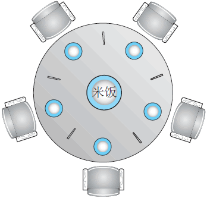

# Dining philosophers problem

一、

1、这个问题是最最能够体现deadlock、livelock的

2、它最最能够体现circular dependency

二、这个问题本身就包含了circle: "圆桌" --》 circle；因此它天生就有circular dependency问题；

因此解决方案，就是要"破环"，可以:

1、引入Arbitrator，对应 "服务生解法/Arbitrator solution"

2、引入hierarchy

三、在下面文章中给出了demo code

mariusbancila [Dining Philosophers in C++11](https://mariusbancila.ro/blog/2017/01/16/dining-philosophers-in-cpp11/)

mariusbancila [Dining philosophers in C++11: Chandy-Misra algorithm](https://mariusbancila.ro/blog/2017/01/20/dining-philosophers-in-c11-chandy-misra-algorithm/)

在下面的是一些开源实现:

1、[mtking2](https://github.com/mtking2)/**[dining-philosophers](https://github.com/mtking2/dining-philosophers)**

2、[graninas](https://github.com/graninas)/**[cpp_philosophers_stm](https://github.com/graninas/cpp_philosophers_stm)**


四、这个问题可以进一步地抽象为一个: 资源分配问题，它的一个要求:

1、要保证公平性，其实starvation就是一种极端的不公平

2、不会死锁


## biancheng [哲学家就餐问题分析（含解决方案）](http://c.biancheng.net/view/1233.html)

> NOTE: 
>
> 1、问题描述非常好

假设有 5 个哲学家，他们的生活只是思考和吃饭。这些哲学家共用一个**圆桌**，每位都有一把椅子。在桌子中央有一碗米饭，在桌子上放着 5 根筷子（图 1 )。



当一位哲学家思考时，他与其他同事不交流。时而，他会感到饥饿，并试图拿起与他相近的两根筷子（筷子在他和他的左或右邻居之间）。一个哲学家一次只能拿起一根筷子。显然，他不能从其他哲学家手里拿走筷子。当一个饥饿的哲学家同时拥有两根筷子时，他就能吃。在吃完后，他会放下两根筷子，并开始思考。

哲学家就餐问题是一个经典的同步问题，这不是因为其本身的实际重要性，也不是因为计算机科学家不喜欢哲学家，而是因为它是大量并发控制问题的一个例子。这个代表型的例子满足：在多个进程之间分配多个资源，而且不会出现死锁和饥饿。

> NOTE: 
>
> 1、饥饿指的是 "resource starvation"

### 信号量

一种简单的解决方法是每只筷子都用一个信号量来表示。一个哲学家通过执行操作 `wait()` 试图获取相应的筷子，他会通过执行操作 `signal()` 以释放相应的筷子。

因此，共享数据为:

```C
semaphore chopstick[5];
```

其中，`chopstick` 的所有元素都初始化为 1。哲学家 `i` 的结构如下所示：

```C
do {
    wait(chopstick[i]);
    wait(chopstick[(i+1) % 5]); // 取下一个筷子
    /* eat for awhile */
    signal(chopstick[i]);
    signal(chopstick[(i+1) % 5]);
    /* think for awhile */
} while (true);
```

虽然这一解决方案保证两个邻居不能同时进食，但是它可能导致死锁，因此还是应被拒绝的。假若所有 5 个哲学家同时饥饿并拿起左边的筷子。所有筷子的信号量现在均为 0。当每个哲学家试图拿右边的筷子时，他会被永远推迟。

死锁问题有多种可能的补救措施：

1、允许最多 4 个哲学家同时坐在桌子上。

2、只有一个哲学家的两根筷子都可用时，他才能拿起它们（他必须在临界区内拿起两根 辕子)。

3、使用非对称解决方案。即单号的哲学家先拿起左边的筷子，接着右边的筷子；而双 号的哲学家先拿起右边的筷子，接着左边的筷子。

## baike [哲学家就餐问题](https://baike.baidu.com/item/%E5%93%B2%E5%AD%A6%E5%AE%B6%E5%B0%B1%E9%A4%90%E9%97%AE%E9%A2%98/10929794?fr=aladdin)

### 问题描述

#### 死锁 和 活锁

哲学家从来不交谈，这就很危险，可能产生死锁，每个哲学家都拿着左手的餐叉，永远都在等右边的餐叉（或者相反）。即使没有死锁，也有可能发生资源耗尽。例如，假设规定当哲学家等待另一只餐叉超过五分钟后就放下自己手里的那一只餐叉，并且再等五分钟后进行下一次尝试。这个策略消除了死锁（系统总会进入到下一个状态），但仍然有可能发生“[活锁](https://baike.baidu.com/item/活锁)”。如果五位哲学家在完全相同的时刻进入餐厅，并同时拿起左边的餐叉，那么这些哲学家就会等待五分钟，同时放下手中的餐叉，再等五分钟，又同时拿起这些餐叉。

### 问题解法

#### 服务生解法/Arbitrator solution


#### Chandy/Misra解法

1984年，K. Mani Chandy和J. Misra提出了哲学家就餐问题的另一个解法，允许任意的用户（编号P1, ..., Pn）争用任意数量的资源。与迪科斯彻的解法不同的是，这里编号可以是任意的。

1.对每一对竞争一个资源的哲学家，新拿一个餐叉，给编号较低的哲学家。每只餐叉都是“干净的”或者“脏的”。最初，所有的餐叉都是脏的。

2.当一位哲学家要使用资源（也就是要吃东西）时，他必须从与他竞争的邻居那里得到。对每只他当前没有的餐叉，他都发送一个请求。

3.当拥有餐叉的哲学家收到请求时，如果餐叉是干净的，那么他继续留着，否则就擦干净并交出餐叉。

4.当某个哲学家吃东西后，他的餐叉就变脏了。如果另一个哲学家之前请求过其中的餐叉，那他就擦干净并交出餐叉。

这个解法允许很大的[并行性](https://baike.baidu.com/item/并行性)，适用于任意大多问题。


## wikipedia [Dining philosophers problem](https://en.wikipedia.org/wiki/Dining_philosophers_problem)

### Resource hierarchy solution

> NOTE: 
>
> 1、lock hierarchy 就是遵循这种思路，参见 drdobbs [Use Lock Hierarchies to Avoid Deadlock](https://www.drdobbs.com/parallel/use-lock-hierarchies-to-avoid-deadlock/204801163) ，其中有着非常好的描述。
>
> 2、这种方案是一种 "Autonomy 自治的-and-decentralization 去中心化"

This solution to the problem is the one originally proposed by [Dijkstra](https://en.wanweibaike.com/wiki-Edsger_W._Dijkstra). It assigns a [partial order](https://en.wanweibaike.com/wiki-Partially_ordered_set) to the resources (the forks, in this case), and establishes the convention that all resources will be requested in order, and that no two resources unrelated by order will ever be used by a single unit of work at the same time. 

Here, the resources (forks) will be numbered 1 through 5 and each unit of work (philosopher) will always pick up the lower-numbered fork first, and then the higher-numbered fork, from among the two forks they plan to use. The order in which each philosopher puts down the forks does not matter. In this case, if four of the five philosophers simultaneously pick up their lower-numbered fork, only the highest-numbered fork will remain on the table, so the fifth philosopher will not be able to pick up any fork. Moreover, only one philosopher will have access to that highest-numbered fork, so he will be able to eat using two forks.

> NOTE: 
>
> 一、按照上述方式推演:，存在下面的一种情况(需要注意的是，由于thread的执行是由OS来调度的，因此实际的执行情况是非常多的，下面是其中的一种情况)
>
> 第一位哲学家在第一轮能够拿到两个fork
>
> 第五位哲学家在第一轮是不会拿起fork的，因为轮到他的时候只剩下了"highest-numbered fork"

While the resource hierarchy solution avoids deadlocks, it is not always practical, especially when the list of required resources is not completely known in advance. For example, if a unit of work holds resources 3 and 5 and then determines it needs resource 2, it must release 5, then 3 before acquiring 2, and then it must re-acquire 3 and 5 in that order. Computer programs that access large numbers of database records would not run efficiently if they were required to release all higher-numbered records before accessing a new record, making the method impractical for that purpose.[[2\]](https://en.wanweibaike.com/wiki-Dining philosophers problem#cite_note-formalization-2)

> NOTE: 
>
> 1、上述是非常好的分析，从上述的分析来看，lock hierarchy不是一种高效的方式

The resource hierarchy solution is not *fair*. If philosopher 1 is slow to take a fork, and if philosopher 2 is quick to think and pick its forks back up, then philosopher 1 will never get to pick up both forks. A fair solution must guarantee that each philosopher will eventually eat, no matter how slowly that philosopher moves relative to the others.

> NOTE: 
>
> 1、公平性

### Arbitrator solution

> NOTE: 
>
> 这种方案是"Arbitrator仲裁者-中心化"

### Chandy/Misra solution

> NOTE: 
>
> 1、这种方案是一种 "Autonomy 自治的-and-decentralization 去中心化"
>
> 2、前面的 baike [哲学家就餐问题](https://baike.baidu.com/item/%E5%93%B2%E5%AD%A6%E5%AE%B6%E5%B0%B1%E9%A4%90%E9%97%AE%E9%A2%98/10929794?fr=aladdin) 中有翻译

In 1984, [K. Mani Chandy](https://en.wanweibaike.com/wiki-K._Mani_Chandy) and [J. Misra](https://en.wanweibaike.com/wiki-Jayadev_Misra)[[5\]](https://en.wanweibaike.com/wiki-Dining philosophers problem#cite_note-5) proposed a different solution to the dining philosophers problem to allow for arbitrary agents (numbered *P*1, ..., *Pn*) to contend for an arbitrary number of resources, unlike Dijkstra's solution. It is also completely distributed and requires no central authority after initialization. However, it violates the requirement that "the philosophers do not speak to each other" (due to the request messages).

1、For every pair of philosophers contending for a resource, create a fork and give it to the philosopher with the lower ID (*n* for agent *Pn*). Each fork can either be *dirty* or *clean.* Initially, all forks are dirty.

> NOTE: 
>
> 1、上面这段话中的"create a fork "是什么含义？"新拿一个餐叉"

2、When a philosopher wants to use a set of resources (*i.e.*, eat), said philosopher must obtain the forks from their contending neighbors. For all such forks the philosopher does not have, they send a request message.

3、When a philosopher with a fork receives a request message, they keep the fork if it is clean, but give it up when it is dirty. If the philosopher sends the fork over(送出去), they clean the fork before doing so.

4、After a philosopher is done eating, all their forks become dirty. If another philosopher had previously requested one of the forks, the philosopher that has just finished eating cleans the fork and sends it.


> NOTE: 
>
> 一、后面介绍了它的优势: 
>
> 1、允许很大的[并行性](https://baike.baidu.com/item/并行性)，适用于任意大多问题
>
> 2、solves the starvation problem
>
> 后面进行了一些分析来论述为什么这种方案是可行的

**提供并发**

This solution also allows for a large degree of concurrency, and will solve an arbitrarily large problem.

**solves the starvation problem**

> NOTE: 
>
> 一、从下面的描述来看，它使用"clean/dirty labels"实现了一种均衡的维持公平的策略，虽然没有对它进行形式化的分析，但是从下面的描述来看，它是非常灵活、巧妙的:
>
> 1、当吃完后，就将自己的fork置为**dirty**: 
>
> giving a disadvantage to processes that have just "eaten"
>
> 2、当收到请求后，将自己的fork置位**clean**，然后交给请求方:
>
> giving preference(偏向于) to the most "starved" processes

It also solves the **starvation problem**. The **clean/dirty labels** act as a way of giving preference(偏向于、提供优先级) to the most "starved" processes, and a disadvantage(降低优先级) to processes that have just "eaten". One could compare their solution to one where philosophers are not allowed to eat twice in a row without letting others use the forks in between. Chandy and Misra's solution is more flexible than that, but has an element tending in that direction.

**Formal analysis**

> NOTE: 
>
> 一、思考: 
>
> 1、它是如何得出  [directed acyclic graph](https://en.wanweibaike.com/wiki-Directed_acyclic_graph) 的？
>
> 2、为什么"Initializing the system so that philosophers with lower IDs have dirty forks ensures the graph is initially acyclic"？
>
> 

In their analysis, they derive a system of preference levels from the distribution of the forks and their clean/dirty states. They show that this system may describe a [directed acyclic graph](https://en.wanweibaike.com/wiki-Directed_acyclic_graph), and if so, the operations in their protocol cannot turn that graph into a cyclic(有环的) one. This guarantees that deadlock cannot occur. However, if the system is initialized to a perfectly symmetric state, like all philosophers holding their left side forks, then the graph is cyclic at the outset(开始), and their solution cannot prevent a deadlock. Initializing the system so that philosophers with lower IDs have dirty forks ensures the graph is initially acyclic.


## TODO

golangprograms [Golang Concurrency # Illustration of the dining philosophers problem in Golang](https://www.golangprograms.com/go-language/concurrency.html)