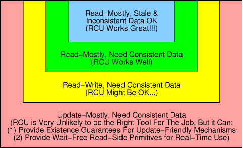

# lwn [User-space RCU](https://lwn.net/Articles/573424/#Using%20URCU)

The [user-space read-copy update (URCU) library](http://liburcu.org/) was established in February of 2009, and is now used by several projects and available from several distributions. URCU is similar to its Linux-kernel counterpart, providing a replacement for reader-writer locking, among other uses. 

### Using URCU

#### When is URCU useful?

RCU is a specialized synchronization mechanism, and its performance, scalability, and real-time response advantages are due to this specialization. It is always important to use the right tool for the job, and RCU is no exception to this rule. The following diagram gives some rules of thumb for where RCU is best used:

> NOTE: 
>
> 1、总结得非常好