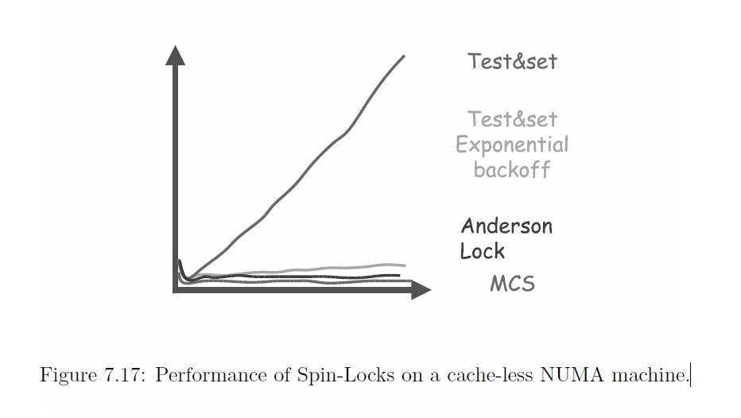

# [Multiprocessor Programming](http://www.cs.tau.ac.il/~shanir/multiprocessor-synch-2003/)


## Chapter 7 Spin Locks and Contention Management

> NOTE: 
>
> 1、下载了，这个内容还不错

### 7.1 Introduction


```java
public interface Lock {
  void acquire();
  void release();
}

public class FAIRegister {
  private int value;
  private Lock lock;
  public FAIRegister() {}
  int read() {
    return value;
  }
  void write(int x) {
    value = x;
  }
  int fetchAndInc() {
    int oldValue;
    lock.acquire();
    oldValue = value++;
    lock.release();
    return oldValue;
  }
}

public class TASRegister implements Register {
  private int value;
  public synchronized int TAS() {
    int oldValue = value;
    this.value = 1;
    return oldValue;
  }
  public int read() {
    return value;
  }
  public void write(int x) {
    value = x;
  }
}

public class TASLock implements Lock {
  private TASRegister value = new TASRegister(0);
  public void acquire() {
    while (value.TAS() == 1) {}
  }
  public void release() {
    value.write(0);
  }
}

public class TTASLock implements Lock {
  private TASRegister value = new TASRegister(0);
  public void acquire() {
    while (true) {
      while (value.read() == 1) {}
      if (value.TAS() == 0)
        return;
    }
  }
  public void release() {
    value.write(0);
  }
}
```


### 7.2 Multiprocessor Architectures

Simplifying slightly, there are four kinds of basic architectures.


### 7.3 Cache Memory & Consistency


### 7.4 TAS-Based Spin Locks

In the simple `TASLock` implementation, each `TAS` operation goes over the bus(会经过bus). Since all of the waiting threads are continually using the bus, all threads, even those not waiting for the lock, end up having to wait to use the bus for their memory accesses. Even worse, the `TAS` operation invalidates all cached copies of the lock, so every spinning thread encounters a cache miss every time, and has to use the bus. When the thread holding the lock tries to release it, it may be delayed waiting to use the bus that is currently monopolized(垄断) by the spinners. No wonder the `TASLock` performs so poorly.

> NOTE: 
>
> 这段话总结地非常好: 
>
> 1、每个 "`TAS` operation" 都会经过bus，因为所有的waiting thread(都在不停地执行 "`TAS` operation" )都在不断使用bus，显然这会造成非常严重的**bus traffic**、flood，及时没有"waiting for the lock"的thread，也会受影响。
>
> 2、由于 "`TAS` operation"，会 "invalidates all cached copies of the lock"，因此，每个spinning thread都会 "encounters a cache miss every time"
>
> 3、最后一段话的意思是: 当持有lock的thread去释放它的时候，它可能被"delayed"，因为此时bus可能被其他的spinner "monopoliz"

Now consider the behavior of the `TTASLock` implementation while the lock is held by some thread. The first time a thread reads the lock it takes a cache miss and loads the value (which is 1) into its cache. As long as the lock is held, the thread repeatedly rereads the value, and each time it hits in its cache. While it is waiting, it produces no **bus traffic**, allowing other threads to get to memory unhindered by bus traffic, without hindering other processors, and allowing lock holder to release it without having to contest control of the bus from spinners. 

> NOTE: 
>
> 1、上面总结了`TTASLock`的优势

Things get worse, however, when the lock is released. The lock holder releases the lock by writing 0 to the lock variable, which immediately invalidates the spinners’ cached copies. They each take a **cache miss**, load the new value, and all (more-or-less simultaneously) call TAS to grab the lock. The first to succeed invalidates the others, who then sequentially reread the value, causing a storm of bus traffic until the processors settle down once again to local spinning.

> NOTE: 
>
> 1、上面总结了`TTASLock`的劣势

This notion of **local spinning**, where threads repeatedly reread cached values instead of repeatedly using the bus, is an important principle critical to the design of efficient spin locks.

### 7.5 Introducing Delays


### 7.6 Delay After Release


#### 7.6.1 Static Delays


#### 7.6.2 Dynamic Delays


### 7.7 Delay After Every Lock Reference


#### 7.7.1 Exponential Backoff


### 7.8 Queue Locks


#### 7.8.1 An Array Based Queue Lock

In Figure 7.14 we present the code of the **A-lock**. The idea is simple, keep an array and a `tail` counter which indexes into the array. The `tail` counter is accessed by a **fetch-and-increment** operation by every thread wishing to acquire the lock. Initially all entries in the queue except location `0` are set to `WAIT`. The `tail` counter is set to `0` and location `0` is set to `ENTER`. Each thread performs a fetch-and-increment on the `tail`, receiving the index of the slot it must wait on and incrementing the counter to point to the slot in which the next thread to arrive will spin on. It then spins on that slot in the array until a thread leaving the critical section sets it to `ENTER`. The lock improves on exponential backoff since it reduces invalidations to a minimum, provides FIFO ordering, and schedules access to the critical section tightly, minimizing the time from when it is freed by one thread to when it is reacquired by another. The fact that fetch-and-increment is not available on modern hardware is not a limitation since an efficient lock-free implementation of fetch-and-increment from compareand-swap is easy to implement. The A-lock’s main limitation is that it is not clear how to cache the array slots in memory. In any case we need to allocated the full array per lock even if only a subset of threads will ever access it.

> NOTE: 
>
> 1、上面总结了A-lock的优势、劣势

```java
public class alock implements lock {
  private RMWRegister tail = new RMWRegister(0);
  public void acquire() {
    myslot[i] = tail.fetchInc();
    while (flags[myslot[i]] % n) == WAIT) {};
    flags[myslot[i] % n] = WAIT;
}
public void release() {
  flags[myslot[i] + 1 % n] = ENTER;
}
}
```

> NOTE:
>
> 1、`RMWRegister` 中的 `RMW`是什么含义？应该是 "Read–modify–write" 的意思

#### 7.8.2 The CLH queue lock

The **CLH lock** improves on the **A-lock** by allocating the slots on which threads spin dynamically. Figure 7.15 shows a simplified version of the CLH Queue
Lock. The lock is a virtual linked list of `Qnode` objects, each waiting to enter the critical section. We use the term “virtual” since unlike conventional linked lists, it cannot be passively traversed because the **pointers** in the list are the threads’ private `pred` variables. We will not deal here with recycling(循环利用) of the `Qnode` objects though this can be done rather efficiently through simple modifications of the above code.

> NOTE: 
>
> 1、`pred` 是 "predecessor(前辈、前驱)" 的缩写，因为在CLH queue 中，每个node所关注的是它的"前驱节点"

To acquire the lock, a thread creates a `Qnode` structure, sets its `locked` variable to indicate that it has not yet released the critical section, and atomically
places its own `Qnode` at the tail of the list while finding the `Qnode` object of its predecessor. It then spins on the `locked` variable of its predecessor (if there is one), waiting until the predecessor(前辈、前驱) sets the `locked` field of its `Qnode` to false. To release the lock, a thread sets the `locked` field of its `Qnode` to `false`. The key point here is that each thread spins on a distinct location, so when one thread releases its lock, it does not invalidate every waiting thread’s cache, only the cache of its immediate successor.

```java
public class CLHLock {
  class Qnode {
    boolean locked = true;
  }
  /** Queue points to an unowned Qnode with locked == false */
  private RMWRegister queue = new RMWRegister(new Qnode());
  /** Creates a new instance of TASLock */
  public CLHLock() {}
  public void acquire(Qnode mynode) {
    /** mynode.locked == true */
    Qnode pred = (Qnode) queue.swap(mynode); /** find predecessor */
    while (pred.locked) {}
  }
  public void release(Qnode mynode) {
    mynode.locked = false;
    /** can use pred as Qnode for next acquire */
  }
}
```


#### 7.8.3 The MCS queue lock

The CLH algorithm relies on the fact that a thread spins on a locally cached copy of its prececessor’s `Qnode`, since the `Qnode` itself was created by another thread, and on a distributed memory machine will be local to that thread. What do we do however if the machine is distributed, that is, is a NUMA machine, and is non-coherent, so the cost of spinning on a remote location is high? The answer is the MCS queue lock algorithm.

> NOTE: 
>
> 一、从上面这段话，其实可以总结出MCS queue lock VS CLH queue lock的本质差异: 
>
> 1、CLH queue lock: 每个 thread spin的是它的predecessor `QNode`的`locked`
>
> 显然，由于spin的频率是非常高的，如果它的predecessor和它之间的通信成本是高的，显然这种方式就不适合了
>
> 2、MCS queue lock: 每个 thread spin的是它自己的`QNode`的`locked`
>
>  显然，及时它的predecessor和它之间的通信成本是高的，这种方式也能够hold住

The MCS Queue Lock (shown in Figure 7.16) implements a queue of processors in a linked list waiting to enter the critical section. Like CLH the lock
is linked-list of `Qnode` objects, where each `Qnode` represents either a **lock holder** or a thread waiting to acquire the lock. This is not a virtual list however. 

To acquire the lock, a thread creates a `Qnode` structure, and places its own `Qnode` atomically at the head of the list. If it has a predecessor it directs a pointer from its predecessor to its `Qnode` so that its predecessor can locate the `Qnode`. It then spins on a local `locked` field in its own `Qnode` waiting until its predecessor sets this field to `false`. To release the lock, a thread locates its predecessor and sets the `locked` field of its predecessor’s `Qnode` to `false`. The key point here is that each thread spins on a distinct local object, so the cost of spinning is low.

> NOTE: 
>
> 一、需要注意的是，上面这段话中的"predecessor"的含义和我们平时所说的linked list的predecessor的含义是不同的
>
> 1、linked list中的predecessor指的是前驱节点，前驱节点的next指针指向current node
>
> 2、上面这段话中的"predecessor"指的是更早进入MCS queue的
>
> 二、"To acquire the lock, a thread creates a `Qnode` structure, and places its own `Qnode` atomically at the head of the list."
>
> 这段话中的"at the head of the list"是有误的，其实是tail  of the queue

The relative performance of the queue lock on a cacheless NUMA machine are shown in Figure 7.17. This is an architecture from the 1980s. As can be seen, MCS outperforms all other techniques. However, the gap between exponential backoff and the MCS lock is small. The relative performance of the queue lock on a state-of-art cache coherent NUMA machine are shown in Figure 7.17. This is an architecture from the 

As can be seen, exponential backoff on a modern NUMA machine is not a reasonable option since it does not scale, and MCS starts to outperform it from
20 processors and on.

```java
public class MCSLock {
  class Qnode {
    boolean locked = false;
    Qnode next = null;
  }
  private RMWRegister queue = new RMWRegister(new Qnode());
  /** Creates a new instance of TASLock */
  public MCSLock() {}
  public void acquire(Qnode mynode) {
    Qnode pred = (Qnode) queue.swap(mynode);
    if (pred != null) {
      mynode.locked = true;
      pred.next = mynode;
      while (mynode.locked) {}
    }
  }
  public void release(Qnode mynode) {
    if (mynode.next == null) {
      if (queue.CAS(mynode, null))
        return;
      while (mynode.next == null) {}
    }
    mynode.next.locked = false;
  }
}
```




cache-coherent.jpg)

### 7.9 Locking in Java


### 7.10 Chapter Notes