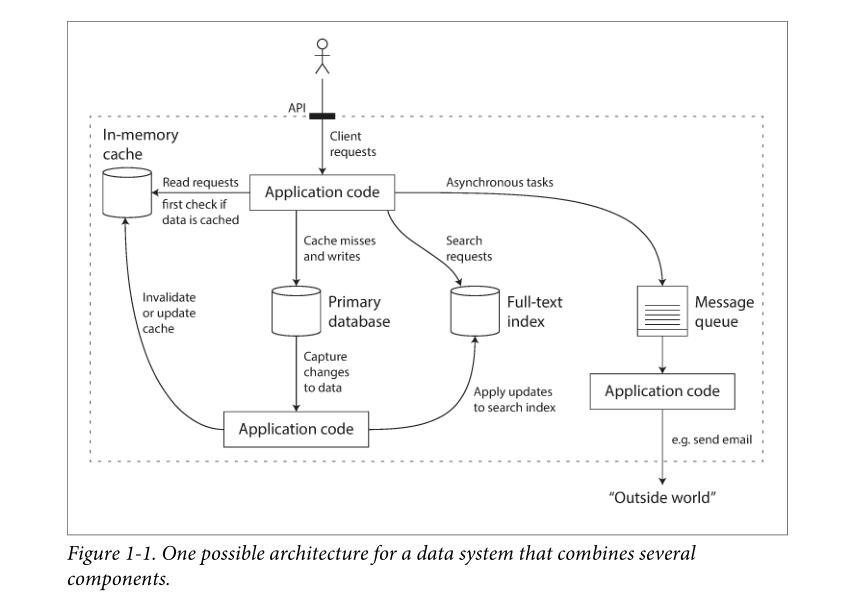

# CHAPTER 1 Reliable, Scalable, and Maintainable Applications

Many applications today are *data-intensive*, as opposed to *compute-intensive*. Raw CPU power is rarely a limiting factor for these applications—bigger problems are usually the amount of data, the complexity of data, and the speed at which it is changing.

> NOTE: *data-intensive*即“数据密集型”，它是[I/O bound](https://en.wikipedia.org/wiki/I/O_bound)； *compute-intensive*即“计算密集型”，它是[CPU-bound](https://en.wikipedia.org/wiki/CPU-bound)。关于这两个词语，在Preface中对它们进行了定义。

A data-intensive application is typically built from standard building blocks that provide commonly needed functionality. For example, many applications need to:

- Store data so that they, or another application, can find it again later (databases)

- Remember the result of an expensive operation, to speed up reads (caches)

- Allow users to search data by keyword or filter it in various ways (search indexes)

- Send a message to another process, to be handled asynchronously (stream processing)

  > NOTE: message queue是stream processing？

- Periodically crunch a large amount of accumulated data (batch processing)

## Thinking About Data Systems

> NOTE: 
>
> ### data system、tool、application
>
> 原文的这一章中，上述三个概念是频繁出现的，作者并没有给出它们的准确定义。其中tool是最好理解的，它的含义就是它的字面意思，redis、Kafka等；application也是比较好理解的，它的含义也是它的字面意思。那如何来理解data system呢？data system是作者创造的一个概念，它是一个抽象，它是本书描述的对象，redis、kafka、以及使用这些tool构建起来的application都可以看做是一种data system，都可以使用本书中的理论来描述它们。

So why should we lump them all together under an umbrella term like data systems?

> NOTE: 使用抽象的思想来理解这段话是非常容易理解的，上面的note已经对此进行了描述。

> NOTE: 原书的紧接着上面这段话的几段作者所要表达的思想是：现实的问题往往更加复杂，无法使用一个单一的model进行描述。

If you are designing a data system or service, a lot of tricky questions arise. How do you ensure that the data remains correct and complete, even when things go wrong internally? How do you provide consistently good performance to clients, even when parts of your system are degraded? How do you scale to handle an increase in load? What does a good API for the service look like?

In this book, we focus on three concerns that are important in most software systems:

*Reliability*

The system should continue to work correctly (performing the correct function at the desired level of performance) even in the face of adversity (hardware or software faults, and even human error). See “Reliability” on page 6.

*Scalability*

As the system grows (in data volume, traffic volume, or complexity), there should be reasonable ways of dealing with that growth. See “Scalability” on page 10.

*Maintainability*

Over time, many different people will work on the system (engineering and operations, both maintaining current behavior and adapting the system to new use cases), and they should all be able to work on it productively. See “Maintainability” on page 18.

