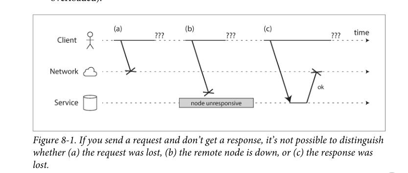

# CHAPTER 8 The Trouble with Distributed Systems

> NOTE: 
>
> 本章所总结的是分布式系统的挑战，它是理解分布式系统中各种问题的关键所在

A recurring theme in the last few chapters has been how systems handle things going wrong. For example, we discussed replica failover (“Handling Node Outages” on page 156), replication lag (“Problems with Replication Lag” on page 161), and concurrency control for transactions (“Weak Isolation Levels” on page 233). As we come to understand various edge cases(极端情况) that can occur in real systems, we get better at handling them.

However, even though we have talked a lot about faults, the last few chapters have still been too optimistic. The reality is even darker. 

Working with distributed systems is fundamentally different from writing software on a single computer—and the main difference is that there are lots of new and exciting ways for things to go wrong. In this chapter, we will get a taste of the problems that arise in practice, and an understanding of the things we can and cannot rely on.

> NOTE: single computer VS distributed system。

In the end, our task as engineers is to build systems that do their job (i.e., meet the guarantees that users are expecting), in spite of everything going wrong. In Chapter 9, we will look at some examples of algorithms that can provide such guarantees in a distributed system. But first, in this chapter, we must understand what challenges we are up against.

This chapter is a thoroughly pessimistic and depressing overview of things that may go wrong in a distributed system. We will look into problems with networks (“Unreliable Networks” on page 277); clocks and timing issues (“Unreliable Clocks” on page 287); and we’ll discuss to what degree they are avoidable. The consequences of all these issues are disorienting, so we’ll explore how to think about the state of a distributed system and how to reason about things that have happened (“Knowledge, Truth, and Lies” on page 300).

## Faults and Partial Failures

> NOTE: 原文首先描述了program on a single computer的**deterministic**，与此相对比的是，program on distributed system的**nondeterministic**。

In distributed systems, we are no longer operating in an idealized system model—we have no choice but to confront the messy reality of the physical world. And in the physical world, a remarkably wide range of things can go wrong, as illustrated by this anecdote

> In my limited experience I’ve dealt with long-lived network partitions in a single data center (DC), PDU [power distribution unit] failures, switch failures, accidental power cycles of whole racks, whole-DC backbone failures, whole-DC power failures, and a hypoglycemic driver smashing his Ford pickup truck into a DC’s HVAC [heating, ventilation, and air conditioning] system. And I’m not even an ops guy.
>
> —Coda Hale

In a distributed system, there may well be some parts of the system that are broken in some unpredictable way, even though other parts of the system are working fine. This is known as a ***partial failure***. The difficulty is that partial failures are ***nondeterministic***: if you try to do anything involving multiple nodes and the network, it may sometimes work and sometimes unpredictably fail. As we shall see, you may not even ***know*** whether something succeeded or not, as the time it takes for a message to travel across a network is also ***nondeterministic***!

> NOTE: 原文中将***know***特地给标注出来了，我觉得它应该是对应的后面的“Knowledge, Truth, and Lies"章节。

If we want to make distributed systems work, we must accept the possibility of **partial failure** and build **fault-tolerance** mechanisms into the software. In other words, we need to build a reliable system from unreliable components. (As discussed in “Reliability” on page 6, there is no such thing as perfect reliability, so we’ll need to understand the limits of what we can realistically promise.)

Even in smaller systems consisting of only a few nodes, it’s important to think about **partial failure**. In a small system, it’s quite likely that most of the components are working correctly most of the time. However, sooner or later, some part of the system will become faulty, and the software will have to somehow handle it. The fault handling must be part of the software design, and you (as operator of the software) need to know what behavior to expect from the software in the case of a fault.

It would be unwise to assume that faults are rare and simply hope for the best. It is important to consider a wide range of possible faults—even fairly unlikely ones—and to artificially create such situations in your testing environment to see what happens. In distributed systems, suspicion, pessimism, and paranoia pay off.

> NOTE: 保持怀疑精神

## Unreliable Networks

Shared-nothing is not the only way of building systems, but it has become the dominant approach for building internet services, for several reasons: it’s comparatively cheap because it requires no special hardware, it can make use of commoditized cloud computing services, and it can achieve high reliability through redundancy across multiple geographically distributed datacenters.

The internet and most internal networks in datacenters (often Ethernet) are asynchronous packet networks. In this kind of network, one node can send a message (a packet) to another node, but the network gives no guarantees as to when it will arrive, or whether it will arrive at all. If you send a request and expect a response, many things could go wrong (some of which are illustrated in Figure 8-1):

1. Your request may have been lost (perhaps someone unplugged a network cable).
2. Your request may be waiting in a queue and will be delivered later (perhaps the network or the recipient is overloaded).
3. The remote node may have failed (perhaps it crashed or it was powered down).
4. The remote node may have temporarily stopped responding (perhaps it is experiencing a long garbage collection pause; see “Process Pauses” on page 295), but it will start responding again later.
5. The remote node may have processed your request, but the response has been lost on the network (perhaps a network switch has been misconfigured).
6. The remote node may have processed your request, but the response has been delayed and will be delivered later (perhaps the network or your own machine is overloaded).

The sender can’t even tell whether the packet was delivered: the only option is for the recipient to send a response message, which may in turn be lost or delayed. These issues are indistinguishable in an asynchronous network: the only information you have is that you haven’t received a response yet. If you send a request to another node and don’t receive a response, it is impossible to tell why.

The usual way of handling this issue is a *timeout*: after some time you give up waiting and assume that the response is not going to arrive. However, when a timeout occurs, you still don’t know whether the remote node got your request or not (and if the request is still queued somewhere, it may still be delivered to the recipient, even if the sender has given up on it).

> NOTE: redis所采用的就是timeout的方式。

### Network Faults in Practice

We have been building computer networks for decades—one might hope that by now we would have figured out how to make them reliable. However, it seems that we have not yet succeeded.

> Network partitions
> When one part of the network is cut off from the rest due to a network fault, that is sometimes called a *network partition* or *netsplit*. In this book we’ll generally stick with the more general term *network fault*, to avoid confusion with partitions (shards) of a storage system, as discussed in Chapter 6.

### Detecting Faults

Many systems need to automatically detect faulty nodes. For example:

- A load balancer needs to stop sending requests to a node that is dead (i.e., take it out of rotation).
- In a distributed database with single-leader replication, if the leader fails, one of the followers needs to be promoted to be the new leader (see “Handling Node Outages” on page 156).

Unfortunately, the uncertainty about the network makes it difficult to tell whether a node is working or not. In some specific circumstances you might get some feedback to explicitly tell you that something is not working:

- If you can reach the machine on which the node should be running, but no process is listening on the destination port (e.g., because the process crashed), the operating system will helpfully close or refuse TCP connections by sending a  RST or  FIN packet in reply. However, if the node crashed while it was handling your request, you have no way of knowing how much data was actually processed by the remote node [22].
- If a node process crashed (or was killed by an administrator) but the node’s operating system is still running, a script can notify other nodes about the crash so that another node can take over quickly without having to wait for a timeout to expire. For example, HBase does this [23].

- If you have access to the management interface of the network switches in your datacenter, you can query them to detect link failures at a hardware level (e.g., if the remote machine is powered down). This option is ruled out if you’re connecting via the internet, or if you’re in a shared datacenter with no access to the switches themselves, or if you can’t reach the management interface due to a network problem.
-  If a router is sure that the IP address you’re trying to connect to is unreachable, it may reply to you with an ICMP Destination Unreachable packet. However, the router doesn’t have a magic failure detection capability either—it is subject to the same limitations as other participants of the network.

Conversely, if something has gone wrong, you may get an error response at some level of the stack, but in general you have to assume that you will get no response at all. You can retry a few times (TCP retries transparently, but you may also retry at the application level), wait for a timeout to elapse, and eventually declare the node dead if you don’t hear back within the timeout.

> NOTE: timeout是一种广泛使用的、准确的方法

### Timeouts and Unbounded Delays

If a timeout is the only sure way of detecting a fault, then how long should the timeout be? There is unfortunately no simple answer.

A long timeout means a long wait until a node is declared dead (and during this time, users may have to wait or see error messages). A short timeout detects faults faster, but carries a higher risk of incorrectly declaring a node dead when in fact it has only suffered a temporary slowdown (e.g., due to a load spike on the node or the network).

Prematurely（过早地） declaring a node dead is problematic: if the node is actually alive and in the middle of performing some action (for example, sending an email), and another node takes over, the action may end up being performed twice. We will discuss this issue in more detail in “Knowledge, Truth, and Lies” on page 300, and in Chapters 9 and 11.

### Network congestion and queueing

When driving a car, travel times on road networks often vary most due to traffic congestion. Similarly, the variability of packet delays on computer networks is most often due to queueing 

## Unreliable Clocks

Clocks and time are important. Applications depend on clocks in various ways to
answer questions like the following:
1. Has this request timed out yet?
2. What’s the 99th percentile response time of this service?
3. How many queries per second did this service handle on average in the last five
minutes?
4. How long did the user spend on our site?
5. When was this article published?
6. At what date and time should the reminder email be sent?
7. When does this cache entry expire?
8. What is the timestamp on this error message in the log file?

## Knowledge, Truth, and Lies

So far in this chapter we have explored the ways in which distributed systems are different from programs running on a single computer: there is no shared memory, only message passing via an unreliable network with variable delays, and the systems may suffer from partial failures, unreliable clocks, and processing pauses.

> NOTE: 这段胡总结的非常好。

The consequences of these issues are profoundly disorienting if you’re not used to distributed systems. A node in the network cannot know anything for sure—it can only make guesses based on the messages it receives (or doesn’t receive) via the network. A node can only find out what state another node is in (what data it has stored, whether it is correctly functioning, etc.) by exchanging messages with it. If a remote node doesn’t respond, there is no way of knowing what state it is in, because problems in the network cannot reliably be distinguished from problems at a node.

Discussions of these systems border on the philosophical: What do we know to be true or false in our system? How sure can we be of that knowledge, if the mechanisms for perception and measurement are unreliable? Should software systems obey the laws that we expect of the physical world, such as cause and effect?

> NOTE: 对这些系统的讨论近乎于哲学。软件系统是否应该遵循我们所期望的物理世界的法则，比如因果关系?

Fortunately, we don’t need to go as far as figuring out the meaning of life. In a distributed system, we can state the **assumptions** we are making about the behavior (the ***system model***) and design the actual system in such a way that it meets those assumptions. Algorithms can be proved to function correctly within a certain **system model**. This means that reliable behavior is achievable, even if the underlying system model provides very few guarantees.

> NOTE: 这段话是什么含义？

However, although it is possible to make software well behaved in an **unreliable system model**, it is not straightforward to do so. In the rest of this chapter we will further explore the notions of **knowledge** and **truth** in distributed systems, which will help us think about the kinds of **assumptions** we can make and the **guarantees** we may want to provide. In Chapter 9 we will proceed to look at some examples of distributed systems, algorithms that provide particular guarantees under particular assumptions.

### The Truth Is Defined by the Majority

The moral（寓意） of these stories is that a node cannot necessarily trust its own judgment of a situation. A distributed system cannot exclusively rely on a single node, because a node may fail at any time, potentially leaving the system stuck and unable to recover. Instead, many distributed algorithms rely on a ***quorum***, that is, voting among the nodes (see “Quorums for reading and writing” on page 179): decisions require some minimum number of votes from several nodes in order to reduce the dependence on any one particular node.

That includes decisions about declaring nodes dead. If a quorum of nodes declares another node dead, then it must be considered dead, even if that node still very much feels alive. The individual node must abide by the quorum decision and step down.