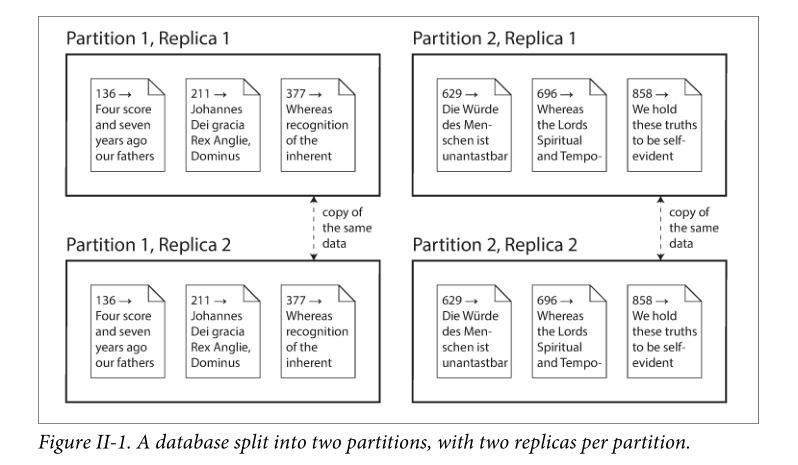

# PART II Distributed Data

In Part I of this book, we discussed aspects of data systems that apply when data is stored on a single machine. Now, in Part II, we move up a level and ask: what happens if multiple machines are involved in storage and retrieval of data?

> NOTE: 参见文章[One-to-multiple](https://dengking.github.io/).

There are various reasons why you might want to distribute a database across multiple machines:

*Scalability*

If your data volume, read load, or write load grows bigger than a single machine can handle, you can potentially spread the load across multiple machines.

*Fault tolerance/high availability*

If your application needs to continue working even if one machine (or several machines, or the network, or an entire datacenter) goes down, you can use multiple machines to give you **redundancy**. When one fails, another one can take over.

> NOTE: 参见：
>
> 维基百科[High availability](https://en.wikipedia.org/wiki/High_availability)
>
> 维基百科[Single point of failure](https://en.wikipedia.org/wiki/Single_point_of_failure)
>
> 维基百科[Redundancy (engineering)](https://en.wikipedia.org/wiki/Redundancy_(engineering))

*Latency*

If you have users around the world, you might want to have servers at various locations worldwide so that each user can be served from a datacenter that is geographically close to them. That avoids the users having to wait for network packets to travel halfway around the world.

## Scaling to Higher Load

> NOTE: 如何进行scale？
>
> shared-memory architecture（vertical scaling or scaling up）
>
> shared-disk architecture
>
> shared-nothing architectures（horizontal scaling or scaling out）

### Shared-Nothing Architectures

> NOTE: 这是本书重点关注的。这总architecture是distributed system。

## Replication Versus Partitioning

There are two common ways data is distributed across multiple nodes:

### *Replication*

Keeping a copy of the same data on several different nodes, potentially in different locations. Replication provides redundancy: if some nodes are unavailable, the data can still be served from the remaining nodes. Replication can also help improve performance. We discuss replication in Chapter 5.

### *Partitioning*

Splitting a big database into smaller subsets called partitions so that different *partitions* can be assigned to different nodes (also known as *sharding*). We discuss partitioning in Chapter 6.

These are separate mechanisms, but they often go hand in hand, as illustrated in Figure II-1.

