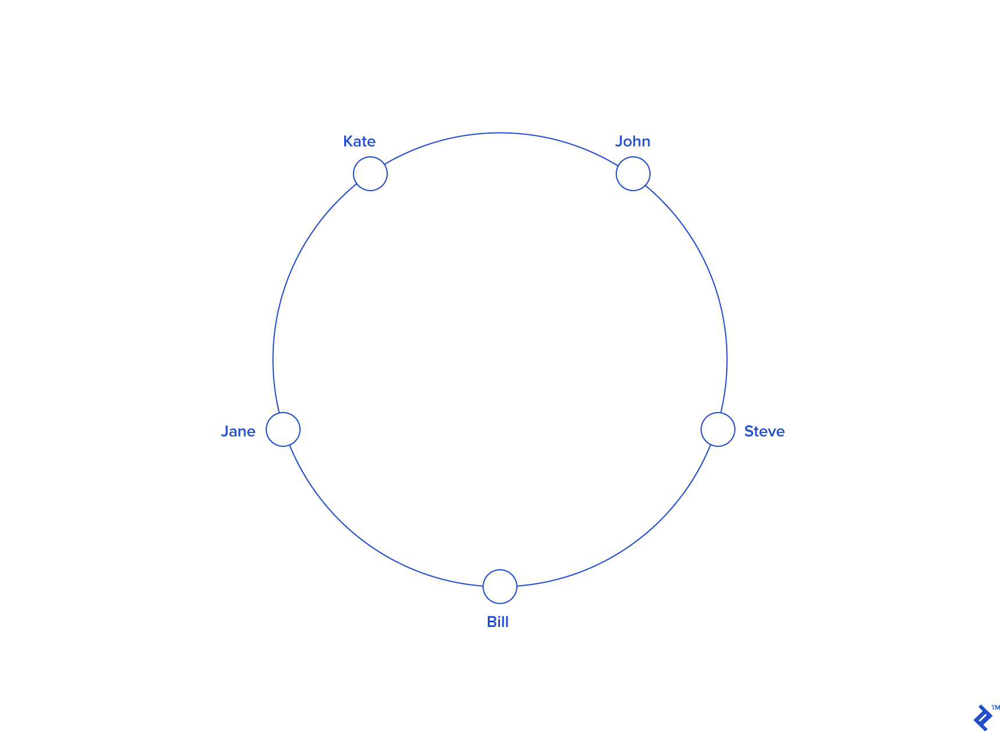

# toptal [A Guide to Consistent Hashing](https://www.toptal.com/big-data/consistent-hashing)

In recent years, with the advent of concepts such as cloud computing and big data, distributed systems have gained popularity and relevance.

One such type of system, [distributed caches](https://en.wikipedia.org/wiki/Distributed_cache) that power many high-traffic dynamic websites and web applications, typically consist of a particular case of **distributed hashing**. These take advantage of an algorithm known as [consistent hashing](https://en.wikipedia.org/wiki/Consistent_hashing).

What is consistent hashing? What’s the motivation behind it, and why should you care?

In this article, I’ll first review the general concept of hashing and its purpose, followed by a description of distributed hashing and the problems it entails. In turn, that will lead us to our title subject.

## What Is Hashing?

What is “hashing” all about? [Merriam-Webster](http://www.merriam-webster.com/dictionary/hash) defines the noun *hash* as “chopped meat mixed with potatoes and browned,” and the verb as “to chop (as meat and potatoes) into small pieces.” So, culinary details aside, hash roughly means “chop and mix”—and that’s precisely where the technical term comes from.

> NOTE: 哈希是什么意思?《韦氏词典》将名词“hash”定义为“将碎肉与土豆混合并煎成褐色”，动词“将(肉和土豆)切成小块”。所以，撇开烹饪细节不谈，hash大致的意思是“切碎和混合”——这正是这个技术术语的来源。

A hash function is a function that maps one piece of data—typically describing some kind of object, often of arbitrary size—to another piece of data, typically an integer, known as *hash code*, or simply *hash*.

For instance, some hash function designed to hash strings, with an output range of `0 .. 100`, may map the string `Hello` to, say, the number `57`, `Hasta la vista, baby` to the number `33`, and any other possible string to some number within that range. Since there are way more possible inputs than outputs, any given number will have many different strings mapped to it, a phenomenon known as *collision*. Good hash functions should somehow “chop and mix” (hence the term) the input data in such a way that the outputs for different input values are spread as evenly as possible over the output range.

**Hash functions** have many uses and for each one, different properties may be desired. There is a type of **hash function** known as ***cryptographic hash functions***, which must meet a restrictive set of properties and are used for **security** purposes—including applications such as password protection, integrity(完整性) checking and fingerprinting of messages, and data corruption detection, among others, but those are outside the scope of this article.

**Non-cryptographic hash functions** have several uses as well, the most common being their use in *hash tables*, which is the one that concerns us and which we’ll explore in more detail.

## Introducing Hash Tables (Hash Maps)

Imagine we needed to keep a list of all the members of some club while being able to search for any specific member. We could handle it by keeping the list in an array (or linked list) and, to perform a search, iterate the elements until we find the desired one (we might be searching based on their name, for instance). In the worst case, that would mean checking all members (if the one we’re searching for is last, or not present at all), or half of them on average. In complexity theory terms, the search would then have complexity `O(n)`, and it would be reasonably fast for a small list, but it would get slower and slower in direct proportion to the number of members.

How could that be improved? Let’s suppose all these club members had a member `ID`, which happened to be a sequential number reflecting the order in which they joined the club.

Assuming that searching by `ID` were acceptable, we could place all members in an array, with their indexes matching their `ID`s (for example, a member with `ID=10` would be at the index `10` in the array). This would allow us to access each member directly, with no search at all. That would be very efficient, in fact, as efficient as it can possibly be, corresponding to the lowest complexity possible, `O(1)`, also known as *constant time*.

But, admittedly, our club member `ID` scenario is somewhat contrived. What if `ID`s were big, non-sequential or random numbers? Or, if searching by `ID` were not acceptable, and we needed to search by name (or some other field) instead? It would certainly be useful to keep our fast direct access (or something close) while at the same time being able to handle arbitrary datasets and less restrictive search criteria.

Here’s where hash functions come to the rescue. A suitable hash function can be used to map an arbitrary piece of data to an integer, which will play a similar role to that of our club member `ID`, albeit with a few important differences.

First, a good hash function generally has a wide output range (typically, the whole range of a 32 or 64-bit integer), so building an array for all possible indices would be either impractical or plain impossible, and a colossal waste of memory. To overcome that, we can have a reasonably sized array (say, just twice the number of elements we expect to store) and perform a *modulo* operation on the hash to get the array index. So, the index would be `index = hash(object) mod N`, where `N`is the size of the array.

Second, object hashes will not be unique (unless we’re working with a fixed dataset and a custom-built [perfect hash function](https://en.wikipedia.org/wiki/Perfect_hash_function), but we won’t discuss that here). There will be *collisions* (further increased by the modulo operation), and therefore a simple direct index access won’t work. There are several ways to handle this, but a typical one is to attach a list, commonly known as a *bucket*, to each array index to hold all the objects sharing a given index.

So, we have an array of size `N`, with each entry pointing to an object bucket. To add a new object, we need to calculate its `hash modulo N`, and check the bucket at the resulting index, adding the object if it’s not already there. To search for an object, we do the same, just looking into the bucket to check if the object is there. Such a structure is called a *hash table*, and although the searches within buckets are linear, a properly sized hash table should have a reasonably small number of objects per bucket, resulting in *almost* constant time access (an average complexity of `O(N/k)`, where `k` is the number of buckets).

With complex objects, the hash function is typically not applied to the whole object, but to a *key*instead. In our club member example, each object might contain several fields (like name, age, address, email, phone), but we could pick, say, the email to act as the key so that the hash function would be applied to the email only. In fact, the key need not be part of the object; it is common to store key/value pairs, where the key is usually a relatively short string, and the value can be an arbitrary piece of data. In such cases, the hash table or hash map is used as a *dictionary*, and that’s the way some high-level languages implement objects or associative arrays.

## Scaling Out: Distributed Hashing

Now that we have discussed hashing, we’re ready to look into *distributed hashing*.

In some situations, it may be necessary or desirable to split a **hash table** into several parts, hosted by different servers. One of the main motivations for this is to bypass the memory limitations of using a single computer, allowing for the construction of arbitrarily large **hash tables** (given enough servers).

> NOTE: 
>
> 1、Redis cluster就是这样做的

In such a scenario, the objects (and their keys) are *distributed* among several servers, hence the name.

A typical use case for this is the implementation of in-memory caches, such as [Memcached](https://en.wikipedia.org/wiki/Memcached).

Such setups consist of a pool of caching servers that host many key/value pairs and are used to provide fast access to data originally stored (or computed) elsewhere. For example, to reduce the load on a database server and at the same time improve performance, an application can be designed to first fetch data from the cache servers, and only if it’s not present there—a situation known as *cache miss*—resort to the database, running the relevant query and caching the results with an appropriate key, so that it can be found next time it’s needed.

Now, how does distribution take place? What criteria are used to determine which keys to host in which servers?

The simplest way is to take the hash *modulo* of the number of servers. That is, `server = hash(key) mod N`, where `N` is the size of the pool. To store or retrieve a key, the client first computes the hash, applies a `modulo N` operation, and uses the resulting index to contact the appropriate server (probably by using a lookup table of IP addresses). Note that the **hash function** used for key distribution must be the same one across all clients, but it need not be the same one used internally by the caching servers.

> NOTE: 
>
> 1、其实分布式hash table中，每个node就是一个slot，这就是"key distribution"

Let’s see an example. Say we have three servers, `A`, `B` and `C`, and we have some string keys with their hashes:

| KEY     | HASH       | HASH mod 3 |
| :------ | :--------- | :--------- |
| "john"  | 1633428562 | 2          |
| "bill"  | 7594634739 | 0          |
| "jane"  | 5000799124 | 1          |
| "steve" | 9787173343 | 0          |
| "kate"  | 3421657995 | 2          |

A client wants to retrieve the value for key `john`. Its `hash modulo 3` is `2`, so it must contact server `C`. The key is not found there, so the client fetches the data from the source and adds it. The pool looks like this:

| A    | B    | C      |
| :--- | :--- | :----- |
|      |      | "john" |

Next another client (or the same one) wants to retrieve the value for key `bill`. Its `hash modulo 3`is `0`, so it must contact server `A`. The key is not found there, so the client fetches the data from the source and adds it. The pool looks like this now:

| A      | B    | C      |
| :----- | :--- | :----- |
| "bill" |      | "john" |

After the remaining keys are added, the pool looks like this:

| A       | B      | C      |
| :------ | :----- | :----- |
| "bill"  | "jane" | "john" |
| "steve" |        | "kate" |

## The Rehashing Problem

This distribution scheme is simple, intuitive, and works fine. That is, until the number of servers changes. What happens if one of the servers crashes or becomes unavailable? Keys need to be redistributed to account for the missing server（key需要重新分发，以弥补丢失的服务器）, of course. The same applies if one or more new servers are added to the pool;keys need to be redistributed to include the new servers. This is true for any distribution scheme, but the problem with our simple modulo distribution is that when the number of servers changes, most `hashes modulo N` will change, so most keys will need to be moved to a different server. So, even if a single server is removed or added, all keys will likely need to be rehashed into a different server.

> NOTE: 上述对问题的总结非常的好；

From our previous example, if we removed server `C`, we’d have to **rehash** all the keys using `hash modulo 2` instead of `hash modulo 3`, and the new locations for the keys would become:

| KEY     | HASH       | HASH mod 2 |
| :------ | :--------- | :--------- |
| "john"  | 1633428562 | 0          |
| "bill"  | 7594634739 | 1          |
| "jane"  | 5000799124 | 0          |
| "steve" | 9787173343 | 1          |
| "kate"  | 3421657995 | 1          |

| A      | B       |
| :----- | :------ |
| "john" | "bill"  |
| "jane" | "steve" |
|        | "kate"  |

Note that all key locations changed, not only the ones from server `C`.

In the typical use case we mentioned before (caching), this would mean that, all of a sudden, the keys won’t be found because they won’t yet be present at their new location.

So, most queries will result in misses, and the original data will likely need retrieving again from the source to be rehashed, thus placing a heavy load on the origin server(s) (typically a database). This may very well degrade performance severely and possibly crash the origin servers.

## The Solution: Consistent Hashing

So, how can this problem be solved? We need a **distribution scheme** that does *not* depend directly on **the number of servers**, so that, when adding or removing servers, the number of keys that need to be relocated is minimized. One such scheme—a clever, yet surprisingly simple one—is called *consistent hashing*, and was first described by [Karger et al. at MIT](http://courses.cse.tamu.edu/caverlee/csce438/readings/consistent-hashing.pdf) in an academic paper from 1997 (according to Wikipedia).

**Consistent Hashing** is a distributed hashing scheme that operates independently of the number of servers or objects in a distributed *hash table* by assigning them a position on an **abstract circle**, or *hash ring*. This allows servers and objects to scale without affecting the overall system.

Imagine we mapped the hash output range onto the edge of a circle（将hash输出值的值域映射到circle上）. That means that **the minimum possible hash value**, zero, would correspond to **an angle of zero**, **the maximum possible value** (some big integer we’ll call `INT_MAX`) would correspond to an angle of 2𝝅 radians (or 360 degrees), and all other **hash values** would linearly fit somewhere in between. So, we could take a key, compute its hash, and find out where it lies on the circle’s edge. Assuming an `INT_MAX` of 1010 (for example’s sake), the keys from our previous example would look like this:

| KEY     | HASH       | ANGLE (DEG) |
| :------ | :--------- | :---------- |
| "john"  | 1633428562 | 58.8        |
| "bill"  | 7594634739 | 273.4       |
| "jane"  | 5000799124 | 180         |
| "steve" | 9787173343 | 352.3       |
| "kate"  | 3421657995 | 123.2       |

Now imagine we also placed the **servers** on the edge of the **circle**, by pseudo-randomly assigning them **angles** too. This should be done in a repeatable（可重复的） way (or at least in such a way that all clients agree on the servers’ angles). A convenient way of doing this is by **hashing** the **server name** (or IP address, or some ID)—as we’d do with any other key—to come up with its angle.

In our example, things might look like this:

| KEY     | HASH       | ANGLE (DEG) |
| :------ | :--------- | :---------- |
| "john"  | 1633428562 | 58.8        |
| "bill"  | 7594634739 | 273.4       |
| "jane"  | 5000799124 | 180         |
| "steve" | 9787173343 | 352.3       |
| "kate"  | 3421657995 | 123.2       |
| "A"     | 5572014558 | 200.6       |
| "B"     | 8077113362 | 290.8       |
| "C"     | 2269549488 | 81.7        |

Since we have the keys for both the **objects** and the **servers** on the same **circle**, we may define a simple rule to **associate** the former with the latter: Each **object key** will belong in the **server** whose key is **closest**, in a counterclockwise direction (or clockwise, depending on the conventions used). In other words, to find out which server to ask for a given key, we need to locate the key on the circle and move in the ascending angle direction until we find a server.

In our example:

| KEY     | HASH       | ANGLE (DEG) |
| :------ | :--------- | :---------- |
| "john"  | 1633428562 | 58.7        |
| "C"     | 2269549488 | 81.7        |
| "kate"  | 3421657995 | 123.1       |
| "jane"  | 5000799124 | 180         |
| "A"     | 5572014557 | 200.5       |
| "bill"  | 7594634739 | 273.4       |
| "B"     | 8077113361 | 290.7       |
| "steve" | 787173343  | 352.3       |

| KEY     | HASH       | ANGLE (DEG) | LABEL | SERVER |
| :------ | :--------- | :---------- | :---- | :----- |
| "john"  | 1632929716 | 58.7        | "C"   | C      |
| "kate"  | 3421831276 | 123.1       | "A"   | A      |
| "jane"  | 5000648311 | 180         | "A"   | A      |
| "bill"  | 7594873884 | 273.4       | "B"   | B      |
| "steve" | 9786437450 | 352.3       | "C"   | C      |

From a programming perspective, what we would do is keep a **sorted list of server values** (which could be angles or numbers in any real interval), and walk this list (or use a binary search) to find the first server with a value greater than, or equal to, that of the desired key. If no such value is found, we need to wrap around, taking the first one from the list.

To ensure **object keys** are evenly distributed among servers, we need to apply a simple trick: To assign not one, but many **labels** (angles) to each **server**. So instead of having labels `A`, `B` and `C`, we could have, say, `A0 .. A9`, `B0 .. B9` and `C0 .. C9`, all interspersed along the circle. The factor by which to increase the number of labels (server keys), known as *weight*, depends on the situation (and may even be different for each server) to adjust the probability of keys ending up on each. For example, if server `B` were twice as powerful as the rest, it could be assigned twice as many labels, and as a result, it would end up holding twice as many objects (on average).

For our example we’ll assume all three servers have an equal weight of 10 (this works well for three servers, for 10 to 50 servers, a weight in the range 100 to 500 would work better, and bigger pools may need even higher weights):

| KEY     | HASH       | ANGLE (DEG) |
| :------ | :--------- | :---------- |
| "C6"    | 408965526  | 14.7        |
| "A1"    | 473914830  | 17          |
| "A2"    | 548798874  | 19.7        |
| "A3"    | 1466730567 | 52.8        |
| "C4"    | 1493080938 | 53.7        |
| "john"  | 1633428562 | 58.7        |
| "B2"    | 1808009038 | 65          |
| "C0"    | 1982701318 | 71.3        |
| "B3"    | 2058758486 | 74.1        |
| "A7"    | 2162578920 | 77.8        |
| "B4"    | 2660265921 | 95.7        |
| "C9"    | 3359725419 | 120.9       |
| "kate"  | 3421657995 | 123.1       |
| "A5"    | 3434972143 | 123.6       |
| "C1"    | 3672205973 | 132.1       |
| "C8"    | 3750588567 | 135         |
| "B0"    | 4049028775 | 145.7       |
| "B8"    | 4755525684 | 171.1       |
| "A9"    | 4769549830 | 171.7       |
| "jane"  | 5000799124 | 180         |
| "C7"    | 5014097839 | 180.5       |
| "B1"    | 5444659173 | 196         |
| "A6"    | 6210502707 | 223.5       |
| "A0"    | 6511384141 | 234.4       |
| "B9"    | 7292819872 | 262.5       |
| "C3"    | 7330467663 | 263.8       |
| "C5"    | 7502566333 | 270         |
| "bill"  | 7594634739 | 273.4       |
| "A4"    | 8047401090 | 289.7       |
| "C2"    | 8605012288 | 309.7       |
| "A8"    | 8997397092 | 323.9       |
| "B7"    | 9038880553 | 325.3       |
| "B5"    | 9368225254 | 337.2       |
| "B6"    | 9379713761 | 337.6       |
| "steve" | 9787173343 | 352.3       |

| KEY     | HASH       | ANGLE (DEG) | LABEL | SERVER |
| :------ | :--------- | :---------- | :---- | :----- |
| "john"  | 1632929716 | 58.7        | "B2"  | B      |
| "kate"  | 3421831276 | 123.1       | "A5"  | A      |
| "jane"  | 5000648311 | 180         | "C7"  | C      |
| "bill"  | 7594873884 | 273.4       | "A4"  | A      |
| "steve" | 9786437450 | 352.3       | "C6"  | C      |

So, what’s the benefit of all this **circle** approach? Imagine server `C` is removed. To account for（弥补） this, we must remove labels `C0 .. C9` from the circle. This results in the object keys formerly adjacent to the deleted labels now being randomly labeled `Ax` and `Bx`, reassigning them to servers `A` and `B`.

But what happens with the other object keys, the ones that originally belonged in `A` and `B`? Nothing! That’s the beauty of it: The absence of `Cx` labels does not affect those keys in any way. So, removing a server results in its object keys being randomly reassigned to the rest of the servers, **leaving all other keys untouched**:

| KEY     | HASH       | ANGLE (DEG) |
| :------ | :--------- | :---------- |
| "A1"    | 473914830  | 17          |
| "A2"    | 548798874  | 19.7        |
| "A3"    | 1466730567 | 52.8        |
| "john"  | 1633428562 | 58.7        |
| "B2"    | 1808009038 | 65          |
| "B3"    | 2058758486 | 74.1        |
| "A7"    | 2162578920 | 77.8        |
| "B4"    | 2660265921 | 95.7        |
| "kate"  | 3421657995 | 123.1       |
| "A5"    | 3434972143 | 123.6       |
| "B0"    | 4049028775 | 145.7       |
| "B8"    | 4755525684 | 171.1       |
| "A9"    | 4769549830 | 171.7       |
| "jane"  | 5000799124 | 180         |
| "B1"    | 5444659173 | 196         |
| "A6"    | 6210502707 | 223.5       |
| "A0"    | 6511384141 | 234.4       |
| "B9"    | 7292819872 | 262.5       |
| "bill"  | 7594634739 | 273.4       |
| "A4"    | 8047401090 | 289.7       |
| "A8"    | 8997397092 | 323.9       |
| "B7"    | 9038880553 | 325.3       |
| "B5"    | 9368225254 | 337.2       |
| "B6"    | 9379713761 | 337.6       |
| "steve" | 9787173343 | 352.3       |

| KEY     | HASH       | ANGLE (DEG) | LABEL | SERVER |
| :------ | :--------- | :---------- | :---- | :----- |
| "john"  | 1632929716 | 58.7        | "B2"  | B      |
| "kate"  | 3421831276 | 123.1       | "A5"  | A      |
| "jane"  | 5000648311 | 180         | "B1"  | B      |
| "bill"  | 7594873884 | 273.4       | "A4"  | A      |
| "steve" | 9786437450 | 352.3       | "A1"  | A      |

Something similar happens if, instead of removing a server, we add one. If we wanted to add server `D` to our example (say, as a replacement for `C`), we would need to add labels `D0 .. D9`. The result would be that roughly one-third of the existing keys (all belonging to `A` or `B`) would be reassigned to `D`, and, again, the rest would stay the same:

| KEY     | HASH       | ANGLE (DEG) |
| :------ | :--------- | :---------- |
| "D2"    | 439890723  | 15.8        |
| "A1"    | 473914830  | 17          |
| "A2"    | 548798874  | 19.7        |
| "D8"    | 796709216  | 28.6        |
| "D1"    | 1008580939 | 36.3        |
| "A3"    | 1466730567 | 52.8        |
| "D5"    | 1587548309 | 57.1        |
| "john"  | 1633428562 | 58.7        |
| "B2"    | 1808009038 | 65          |
| "B3"    | 2058758486 | 74.1        |
| "A7"    | 2162578920 | 77.8        |
| "B4"    | 2660265921 | 95.7        |
| "D4"    | 2909395217 | 104.7       |
| "kate"  | 3421657995 | 123.1       |
| "A5"    | 3434972143 | 123.6       |
| "D7"    | 3567129743 | 128.4       |
| "B0"    | 4049028775 | 145.7       |
| "B8"    | 4755525684 | 171.1       |
| "A9"    | 4769549830 | 171.7       |
| "jane"  | 5000799124 | 180         |
| "B1"    | 5444659173 | 196         |
| "D6"    | 5703092354 | 205.3       |
| "A6"    | 6210502707 | 223.5       |
| "A0"    | 6511384141 | 234.4       |
| "B9"    | 7292819872 | 262.5       |
| "bill"  | 7594634739 | 273.4       |
| "A4"    | 8047401090 | 289.7       |
| "D0"    | 8272587142 | 297.8       |
| "A8"    | 8997397092 | 323.9       |
| "B7"    | 9038880553 | 325.3       |
| "D3"    | 9048608874 | 325.7       |
| "D9"    | 9314459653 | 335.3       |
| "B5"    | 9368225254 | 337.2       |
| "B6"    | 9379713761 | 337.6       |
| "steve" | 9787173343 | 352.3       |

| KEY     | HASH       | ANGLE (DEG) | LABEL | SERVER |
| :------ | :--------- | :---------- | :---- | :----- |
| "john"  | 1632929716 | 58.7        | "B2"  | B      |
| "kate"  | 3421831276 | 123.1       | "A5"  | A      |
| "jane"  | 5000648311 | 180         | "B1"  | B      |
| "bill"  | 7594873884 | 273.4       | "A4"  | A      |
| "steve" | 9786437450 | 352.3       | "D2"  | D      |

This is how **consistent hashing** solves the **rehashing** problem.

In general, only `k/N` keys need to be remapped when `k` is the number of keys and `N` is the number of servers (more specifically, the maximum of the initial and final number of servers).

## What Next?

We observed that when using distributed caching to optimize performance, it may happen that the number of caching servers changes (reasons for this may be a server crashing, or the need to add or remove a server to increase or decrease overall capacity). By using consistent hashing to distribute keys between the servers, we can rest assured that should that happen, the number of keys being rehashed—and therefore, the impact on origin servers—will be minimized, preventing potential downtime or performance issues.

There are clients for several systems, such as Memcached and Redis, that include support for **consistent hashing** out of the box.

Alternatively, you can implement the algorithm yourself, in your language of choice, and that should be relatively easy once the concept is understood.

If data science interests you, Toptal has some of the best articles on the subject at the [blog](https://www.toptal.com/developers/blog/data-science-and-databases)