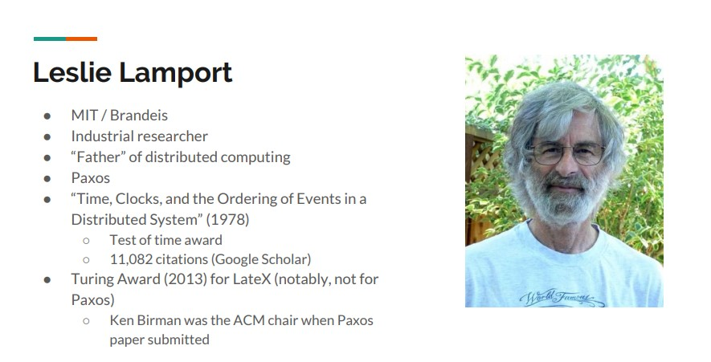

# Leslie Lamport

一、分布式计算领域的开拓者，凭借一己之力，构筑了分布式计算大厦的底座，在下面文章中，对他进行了介绍:

1、范斌 zhihu [漫话分布式系统共识协议: Paxos篇](https://zhuanlan.zhihu.com/p/35737689)

> 在我看来, Paxos算法(连同Lamport的其他如BFT, Vector Clock等成就)是上个世纪八十/九十年代的经典分布式系统研究中最纯粹最优美, 也是整栋大厦底座最坚实的那一部分.

二、cornell [Distributed Systems: Ordering and Consistency](http://www.cs.cornell.edu/courses/cs6410/2018fa/slides/14-lamport-clocks.pdf)

## wikipedia [Leslie Lamport](https://en.wikipedia.org/wiki/Leslie_Lamport)

Leslie Lamport was the winner of the 2013 [Turing Award](https://en.wikipedia.org/wiki/Turing_Award)[[4\]](https://en.wikipedia.org/wiki/Leslie_Lamport#cite_note-4) for imposing clear, well-defined coherence on the seemingly chaotic(混乱的) behavior of [distributed computing](https://en.wikipedia.org/wiki/Distributed_computing) systems, in which several autonomous computers communicate with each other by passing messages. 

> NOTE: "make it computational"

### Career and research

#### Distributed Systems

> NOTE: 需要对它在Distributed Systems中的理论了解一下

Lamport's research contributions have laid the foundations of the theory of distributed systems. Among his most notable papers are

1、"Time, Clocks, and the Ordering of Events in a Distributed System",[[6\]](https://en.wikipedia.org/wiki/Leslie_Lamport#cite_note-timeclocks-6) which received the [PODC Influential Paper Award](https://en.wikipedia.org/wiki/Dijkstra_Prize) in 2000,[[12\]](https://en.wikipedia.org/wiki/Leslie_Lamport#cite_note-12)

> NOTE: lamport timestamp

2、"How to Make a Multiprocessor Computer That Correctly Executes Multiprocess Programs",[[13\]](https://en.wikipedia.org/wiki/Leslie_Lamport#cite_note-13) which defined the notion of [sequential consistency](https://en.wikipedia.org/wiki/Sequential_consistency),

3、"[The Byzantine Generals' Problem](https://en.wikipedia.org/wiki/Byzantine_fault_tolerance)",[[14\]](https://en.wikipedia.org/wiki/Leslie_Lamport#cite_note-14)

4、"Distributed Snapshots: Determining Global States of a Distributed System"[[15\]](https://en.wikipedia.org/wiki/Leslie_Lamport#cite_note-15) and

5、"The Part-Time Parliament".[[16\]](https://en.wikipedia.org/wiki/Leslie_Lamport#cite_note-16)

These papers relate to such concepts as [logical clocks](https://en.wikipedia.org/wiki/Logical_clocks) (and the *[happened-before](https://en.wikipedia.org/wiki/Happened-before)* relationship) and [Byzantine failures](https://en.wikipedia.org/wiki/Byzantine_failure). They are among the most cited papers in the field of computer science,[[17\]](https://en.wikipedia.org/wiki/Leslie_Lamport#cite_note-17) and describe algorithms to solve many fundamental problems in distributed systems, including:

> NOTE: 
>
> 一、上述 happened-before让我想起来C++ memory model中的[std::memory_order](https://en.cppreference.com/w/cpp/atomic/memory_order)中的*happens-before*
>
> 二、上面这段话的意思是: 前面列举的这些论文，都和" [logical clocks](https://en.wikipedia.org/wiki/Logical_clocks) (and the *[happened-before](https://en.wikipedia.org/wiki/Happened-before)* relationship) and [Byzantine failures](https://en.wikipedia.org/wiki/Byzantine_failure)"相关，或者说是基于这两个基本概念的

1、the [Paxos algorithm](https://en.wikipedia.org/wiki/Paxos_algorithm) for [consensus](https://en.wikipedia.org/wiki/Consensus_(computer_science)),

2、the [bakery algorithm](https://en.wikipedia.org/wiki/Lamport's_bakery_algorithm) for [mutual exclusion](https://en.wikipedia.org/wiki/Mutual_exclusion) of multiple threads in a computer system that require the same resources at the same time,

3、the [Chandy-Lamport algorithm](https://en.wikipedia.org/wiki/Chandy-Lamport_algorithm) for the determination of consistent global states (snapshot), and

4、the [Lamport signature](https://en.wikipedia.org/wiki/Lamport_signature), one of the prototypes of the digital signature.

## [LESLIE  LAMPORT'S  HOME  PAGE](http://lamport.org/)

