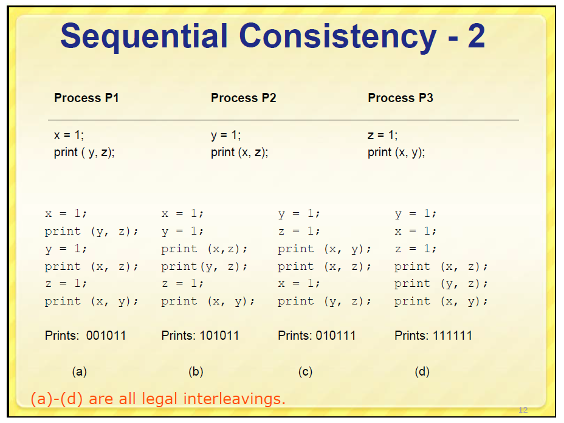

# Sequential consistency


## 总结

相较于strict consistency model，放松了**所有的write立即生效**的限制，因此在Consistency model abstract machine上的运行结果可能存在dirty data的；

Constrain: 实际的运行结果能够使用下面描述的方式进行**模拟**:

能够使用C++11 `std::atomic` 的 sequential consistency来进行模拟，下面简单地描述一下对应关系: 

1、所有entity按照program中的次序运行

2、每个entity对应一个thread，shared data对应process中所有线程共享的数据

3、在一个process中进行运行，可以得到在Consistency model abstract machine上的运行结果。

> NOTE: 关于上述过程的具体例子，参见: stackoverflow [C++11 introduced a standardized memory model. What does it mean? And how is it going to affect C++ programming?](https://stackoverflow.com/questions/6319146/c11-introduced-a-standardized-memory-model-what-does-it-mean-and-how-is-it-g) # [A](https://stackoverflow.com/a/6319356)，其中有非常好的描述。

现在在回过头来看看 Lamport(1979) [Sequential consistency](https://en.wikipedia.org/wiki/Sequential_consistency) 给出的sequential consistency model的定义:

> "... the result of any execution is the same as if the operations of all the processors were executed in some sequential order, and the operations of each individual processor appear in this sequence in the order specified by its program."[[1\]](https://en.wikipedia.org/wiki/Sequential_consistency#cite_note-1)

其中的"as if"告诉我们需要进行模拟。

### 组合分析

有多少种可能的组合？在下面这些文章中，给出了类似的分析: 

#### [Sequential Consistency in Distributed Systems](https://stackoverflow.com/questions/30734060/sequential-consistency-in-distributed-systems) # [A](https://stackoverflow.com/a/32272780)

An execution `e` of operations is sequentially consistent if and only if it can be **permutated** into a sequence `s` of these operations such that:

- the sequence `s` respects the program order of each process. That is, for any two operations `o1` and `o2` which are of the same process and if `o1` precedes `o2` in `e`, then `o1` should be placed before `o2` in `s`;
- in the sequence `s`, each read operation returns the value of the last preceding write operation over the same variable.

------

For (a), `s` can be：

```
W(x)b [P2], R(x)b [P3], R(x)b [P4], W(x)a [P1], R(x)a [P3], R(x)a [P4]
```

For (c), `s` can be:

```
W(x)a [P1], R(x)a [P2], R(x)a [P3], R(x)a [P4], W(x)b [P3], R(x)b [P1], R(x)b [P2], R(x)b [P4]
```

However, for (b):

- the operations `R(x)b, R(x)a` from `P3` require that `W(x)b` come before `W(x)a`
- the operations `R(x)a, R(x)b` from `P4` require that `W(x)a` come before `W(x)b`

It is impossible to construct such a sequence `s`.

#### cs.cmu [10-consistency](http://www.cs.cmu.edu/~srini/15-446/S09/lectures/10-consistency.pdf)





## wikipedia [Sequential consistency](https://en.wikipedia.org/wiki/Sequential_consistency)

> 顺序一致性
>
> sequential order 先后顺序，相继顺序

**Sequential consistency** is one of the [consistency models](https://en.wikipedia.org/wiki/Consistency_model) used in the domain of [concurrent computing](https://en.wikipedia.org/wiki/Concurrent_computing) (e.g. in [distributed shared memory](https://en.wikipedia.org/wiki/Distributed_shared_memory), [distributed transactions](https://en.wikipedia.org/wiki/Distributed_transaction), etc.).

It was first defined as the property that requires that

"... the result of any execution is the same as if the operations of all the processors were executed in some sequential order, and the operations of each individual processor appear in this sequence in the order specified by its program."[[1\]](https://en.wikipedia.org/wiki/Sequential_consistency#cite_note-1)

To understand this statement, it is essential to understand one key property of **sequential consistency**: execution order of program in the same processor (or thread) is the same as the **program order**, while（尽管） execution order of program between processors (or threads) is undefined. In an example like this:

```
 processor 1:     <-- A1 run --> <-- B1 run -->        <-- C1 run -->
 processor 2:       <-- A2 run --> <-- B2 run -->
 Time --------------------------------------------------------------------->
```

execution order between A1, B1 and C1 is preserved, that is, A1 runs before B1, and B1 before C1. The same for A2 and B2. But, as execution order between processors is undefined, B2 might run before or after C1 (B2 might physically run before C1, but the effect of B2 might be seen after that of C1, which is the same as "B2 run after C1")

Conceptually, there is single **global memory** and a "switch" that connects an arbitrary processor to memory at any time step. Each **processor** issues memory operations in **program order** and the switch provides the global serialization among all memory operations[[2\]](https://en.wikipedia.org/wiki/Sequential_consistency#cite_note-2)

[](https://en.wikipedia.org/wiki/File:Rsz_selection_055.png)

The sequential consistency is weaker than [strict consistency](https://en.wikipedia.org/wiki/Strict_consistency), which requires a read from a location to return the value of the last write to that location; strict consistency demands that operations be seen in the order in which they were actually issued.


## `book-Distributed-operating-systems`

在这本书的`6-Distributed-Shared-Memory\6.3.2-Sequential-Consistency`中对sequential

参见`Theory\book-Distributed-operating-systems\6-Distributed-Shared-Memory\6.3.2-Sequential-Consistency`章节。


## csdn [一致性模型之Sequential Consistency](https://blog.csdn.net/qianfeng_dashuju/article/details/90642303)

### Sequential Consistency的定义

Sequential Consistency的精确定义来自于Leslie Lamport老哥(以后我们会多次提到他)。他本来是定义了基于共享内存的多CPU并行计算的一致性模型，但是也可以推广到分布式系统中，实际上多CPU并行计算也都可以认为是分布式系统。模型的定义是:

> the result of any execution is the same as if the operations of all the processors were executed in some sequential order, and the operations of each individual processor appear in this sequence in the order specified by its program

放到分布式系统里，意思就是不管系统怎么运行，得到的结果就好像把所有节点的所有操作按照某个sequential order排序后运行，但是在这个sequential order顺序中，来自同一个节点的操作仍然保持着它们在节点中被指定的顺序（也就是他们在program中指定的顺序）。

### Sequential Consistency的例子

Leslie Lamport老哥的说法一贯的佶屈聱牙，我们通过几个例子来看一下。图中从左向右表示物理时间，W(a)表示写入数据a，R(a)表示读出数据a。

　　


 

　　


 

可以看出，这两个系统都不是很完美，但是它们的模型都可以看做**Sequential Consistency**，因为通过如下变换，总是可以自圆其说，也就是可以找到符合定义的**sequential order**。

　　


 

　　


 

### Sequential Consistency和硬件

也许有人会问，同一个进程中保留操作顺序不是显而易见的么?实际上随着硬件技术，尤其是多核、多CPU技术的发展，一个CPU核心运行的进程，不一定能观测到另一个核心进程的操作顺序。

在论文中，Leslie Lamport老哥举了这样一个例子，有一个互斥算法，要求两个进程不能同时执行临界区方法，a和b两个变量初始值为0。正常情况下，最多一个进程执行临界区方法。

　　进程1执行序列如下：

　　a = 1

　　if (b!=0){

　　临界区方法

　　}

　　进程2执行序列如下：

　　b = 1

　　if (a!=0){

　　临界区方法

　　}

　　这个程序在多核CPU机器上运行时，有可能两个进程同时进入临界区。为什么呢?

　　我们先看一下现代CPU的架构

　　


 

　　CPU一般具有多个核心，每个核心都有自己的L1 cache和L2 cache，cache之上还有Load Buffer和Store Buffer。写入时，处理器很有可能仅仅将数据写入Store Buffer，稍后再将Store Buffer中的数据统一写回cache，有可能再过一会儿才将cache的数据写回内存。同样，一个核心读取的数据说不定也已经被另一个核心修改过，只是它不知道而已。

　　所以上述进程对a和b的赋值，很有可能没被对方感知。

　　为了保证**Sequential Consistency**，Leslie Lamport老哥在论文中提出了两个要求:

　　Each processor issues memory requests in the order specified by its program

　　Memory requests from all processors issued to an individual memory module are serviced from a single FIFO queue. Issuing a memory request consists of entering the request on this queue.

　　但是如果在硬件层满足Sequential Consistency，肯定会大大降低效率，所以一般这些工作就会交给上层的软件开发人员来做。

## Case study

### Case: zookeeper

zookeeper承诺Sequential Consistency，在 [ZooKeeper overview#Guarantees](https://zookeeper.apache.org/doc/r3.6.2/zookeeperOver.html#Guarantees) 中对此进行了说明:

> **Sequential Consistency** - Updates from a **client** will be applied in the order that they were sent.


### Case: C++ memory model

参见工程programming-language的`C++\Language-reference\Basic-concept\Abstract-machine\Memory-model`章节。