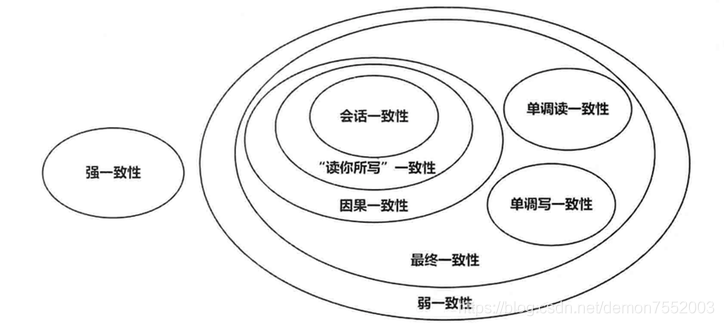

# Primer


## 如何掌握consistency model?

### Consistency model是关于data/memory的model

对data/memory的operation包括

1、read

2、write

### Consistency model是一个非常强大的、适用面非常广泛的model

它能够对multiple model中的shared data进行描述，multiple model能够描述非常多的，下面可以看到:

### Multiple model

Multiple model中的entity可以为:

1、multicore: processor core

2、multithread: thread

3、multiprocess: process

4、distributed computing: node

因此下面的描述的内容，有的时候并不针对上述情况中的一种，而是描述的一种通用的原理。

### 理想 与 现实

**现实**: 各个entity之间存在着**通信延时**(**delay**)，一旦entity对自己的**copy of shared data**做出了write，在完成和其他的entity的**synchronization**之前(**同步延时**)，各个entity的**copy of shared data**是存在着差异的，即各个entity所看到的**shared data**是不同的。

> NOTE: 
>
> replication lag

**理想**: 各个entity之间的**通信延时**为0，或者说，它们之间不存在延时，这样就不存在**同步延时**，这样任何一个entity对自己的copy of shared data的修改能够立即同步到其他的entity中，各个entity的**copy of shared data**是不存在差异的，即各个entity所看到的**shared data**是相同的。其实这就是**strict consistency**。


### Consistency model abstract machine

为了便于理解各种consistency model，本节提出一个consistency model abstract machine，它其实就是programmer站在全局的视角来看待并运行整个multiple model，从而得到输出，它的简单定义如下:

1、所有的entity都独立地运行在这台abstract machine上

> NOTE: 可以认为每个entity有一个自己的processor

2、shared data

> NOTE: 可以认为是memory

3、每个entity都有自己的copy of shared data

> NOTE: 可以认为每个entity都全量的cache shared data

4、每个entity需要将自己对shared data的更改同步到shared data中

5、**全局时钟**、abstract machine的时钟，其实就是墙上时钟，programmer以这个时钟为参考，来看abstract machine上的各个entity，其实就是从programmer的角度来看各个entity的活动。这位programmer提供了观察整个系统的视角。

#### 模拟strict consistency model

**Strict consistency model**是最最理想的情况，同时它也是非常容易理解的。

在strict consistency中，由于:

1、**所有的write都立即生效**(在实际中，可能无法达成)

2、entity的copy of shared data能够一直保持相同

因此**Strict consistency model**可以这样模拟: 

所有的**entity**都在同一个processor上执行，使用同一个shared data，这个processor没有cache，所有的write立即生效。


### Consistency model是contract

1、它是一种contract，遵循一定的contract，则可以实现预期的效果；


### Level and tradeoff

> NOTE: 有哪些constrain、相较于上一层，放松了哪些constrain。

2、每种consistency model都有constrain，从而决定了consistency model的strong、weak

1、strict consistency是最最理想的、容易理解情况，可以以它来作为对比

2、在现实应用中，strict consistency的实现是比较困难的，并且有的application不需要strict consistency，因此可以放宽constrain，使用weak consistency model

3、programmer需要进行tradeoff


## csdn [强一致性、顺序一致性、弱一致性和共识](https://blog.csdn.net/chao2016/article/details/81149674)

> NOTE: 比较难以理解的:
>
> "系统中进程看到的顺序"和 "全局时钟下的顺序"
>
> 因为系统中的每个node都有一份copy，因此它们各自对自己的copy都进行了read、write，因此每个node都有自己的实际操作的顺序，这就是所谓"系统中进程看到的顺序"；
>
> "全局时钟下的顺序"则是指理想的状态(顺序)，这种理想状态可以这样来模拟: 由于所有的node share data，所有的node都是在对shared data进行operation(read、write)，因此可以认为所有的node都在同一个processor上执行，显然这种情况下，它们就有一个全局时钟了，在这个理想的状态(顺序)下，所有的write都立即生效(在实际中，可能无法达成)，就好比在同一个processor，这就是"强一致性（Strong Consistency）"。
>
> 由于系统中的每个node都有一份copy，change在它们之间同步是需要时间的。
>
> 不是所有的consistency model都参考了**全局时钟**的，"Sequential Consistency"就没有参考"全局时钟"，貌似只有strong consistency才参考了"全局时钟"。Sequential Consistency貌似仅仅强调sequence；

### 1. 一致性（Consistency）

一致性（Consistency）是指多副本（Replications）问题中的数据一致性。可以分为强一致性、顺序一致性与弱一致性。

### 1.1 强一致性（Strong Consistency）

也称为：

原子一致性（Atomic Consistency）
线性一致性（Linearizable Consistency）

两个要求：

- 任何一次读都能读到某个数据的最近一次写的数据。
- 系统中的所有进程，看到的操作顺序，都和**全局时钟下的顺序一致**。

简言之，在任意时刻，所有节点中的数据是一样的。

例如，对于关系型数据库，要求更新过的数据能被后续的访问都能看到，这是强一致性。

> NOTE: 

### 1.2 顺序一致性（Sequential Consistency）

> the result of any execution is the same as if the operations of all the processors were executed in some sequential order, and the operations of each individual processor appear in this sequence in the order specified by its program. - - Lamport

两个要求：

- 任何一次读都能读到某个数据的最近一次写的数据。
- 系统的所有进程的顺序一致，而且是合理的。即不需要和全局时钟下的顺序一致，错的话一起错，对的话一起对。

举个栗子： 


> NOTE: 上图其实是一个space-time diagram，横轴表示的全局时钟; 下面是模拟程序:
>
> ```C++
>            Global
>            int x=0, y=0;
> 
> Process 1           Process 2
> x = 4;              y=2
> cout<<y;            cout<<x;
> ```
>
> 

Write(x, 4)：写入x=4 
Read(x, 0)：读出x=0

1）图a是满足**顺序一致性**，但是不满足**强一致性**的。原因在于，从**全局时钟**的观点来看，P2进程对变量`X`的读操作在P1进程对变量X的写操作之后，然而读出来的却是旧的数据。但是这个图却是满足**顺序一致性**的，因为两个进程P1，P2的一致性并没有冲突。从这两个进程的角度来看，**顺序**应该是这样的：Write(y,2) , Read(x,0) , Write(x,4), Read(y,2)，每个进程内部的读写顺序都是合理的，但是这个顺序与**全局时钟**下看到的顺序并不一样。

> NOTE: 输出为`02`;
>
> "从**全局时钟**的观点来看，P2进程对变量`X`的读操作在P1进程对变量X的写操作之后，然而读出来的却是旧的数据"的可能方式的: 
>
> `Write(x, 4)`由于网络延时，导致更新的数据没有及时同步到P2中，因此P2读出的是旧值
>
> 每个P中，load和store是维持的；
>
> 上述 "从这两个进程的角度来看，**顺序**应该是这样的：Write(y,2) , Read(x,0) , Write(x,4), Read(y,2)"，其中得出的顺序其实也是将两个process模拟到同一个processor上得出的，准确来说，使用C++11 `std::atomic` 的 sequential consistency来进行模拟，参见 "introduction" 章节；

2）图b满足**强一致性**，因为每个读操作都读到了该变量的最新写的结果，同时两个进程看到的操作顺序与全局时钟的顺序一样，都是Write(y,2) , Read(x,4) , Write(x,4), Read(y,2)。

> NOTE: "Write(y,2) , Read(x,4) , Write(x,4), Read(y,2)"是有误的 ，应该是"Write(y,2) , Write(x,4), Read(x,4) , Read(y,2)"

3）图c不满足顺序一致性，当然也就不满足强一致性了。因为从进程P1的角度看，它对变量Y的读操作返回了结果0。那么就是说，P1进程的对变量Y的读操作在P2进程对变量Y的写操作之前，这意味着它认为的顺序是这样的：write(x,4) , Read(y,0) , Write(y,2), Read(x,0)，显然这个顺序又是不能被满足的，因为最后一个对变量x的读操作读出来也是旧的数据。因此这个顺序是有冲突的，不满足顺序一致性。

> NOTE: 输出为`00`;
>
> 可能方式: 
>
> `Write(x, 4)`由于网络延时，导致更新的数据没有及时同步到P2中，因此P2读出的是旧值
>
> `Write(y, 2)`由于网络延时，导致更新的数据没有及时同步到P2中，因此P1读出的是旧值
>
> 此时每个P中，load和store的order被reorder了；


### 1.3 弱一致性

数据更新后，如果能容忍后续的访问只能访问到部分或者全部访问不到，则是**弱一致性**。

**最终一致性**就属于**弱一致性**。

#### 最终一致性

不保证在任意时刻任意节点上的同一份数据都是相同的，但是随着时间的迁移，不同节点上的同一份数据总是在向趋同的方向变化。

简单说，就是在一段时间后，节点间的数据会最终达到一致状态。

**最终一致性**根据更新数据后各进程访问到数据的时间和方式的不同，又可以区分为：

1、因果一致性（Casual Consistency）。如果进程A通知进程B它已更新了一个数据项，那么进程B的后续访问将返回更新后的值，且一次写入将保证取代前一次写入。与进程A无因果关系的进程C的访问，遵守一般的最终一致性规则。

2、“读己之所写（read-your-writes）”一致性。当进程A自己更新一个数据项之后，它总是访问到更新过的值，绝不会看到旧值。这是因果一致性模型的一个特例。

3、会话（Session）一致性。这是上一个模型的实用版本，它把访问存储系统的进程放到会话的上下文中。只要会话还存在，系统就保证“读己之所写”一致性。如果由于某些失败情形令会话终止，就要建立新的会话，而且系统的保证不会延续到新的会话。

4、单调（Monotonic）读一致性。如果进程已经看到过数据对象的某个值，那么任何后续访问都不会返回在那个值之前的值。

5、单调写一致性。系统保证来自同一个进程的写操作顺序执行。要是系统不能保证这种程度的一致性，就非常难以编程了。

### 共识（Consensus)

共识问题中所有的节点要最终达成共识，由于最终目标是所有节点都要达成一致，所以根本不存在一致性强弱之分。

例如，Paxos是共识（Consensus）算法而不是强一致性（Consistency）协议。共识算法没有一致性级别的区分。


## csdn [分布式一致性协议](https://blog.csdn.net/demon7552003/article/details/86657767)

一致性（Consistency）是指多副本（Replications）问题中的数据一致性。关于分布式系统的一致性模型有以下几种：

### 强一致性

当更新操作完成之后，任何多个**后续**进程或者线程的访问都会**返回最新的更新过的值**，直到这个数据被其他数据更新为止。
但是这种实现对性能影响较大，因为这意味着，只要上次的操作没有处理完，就不能让用户读取数据。

### 弱一致性

系统并不保证进程或者线程的访问都会返回最新更新过的值。系统在数据写入成功之后，**不承诺立即可以读到最新写入的值**，也不会具体的承诺多久之后可以读到。甚至不能保证可以访问到。

### 最终一致性

**最终一致性也是弱一致性的一种**，它无法保证数据更新后，所有后续的访问都能看到最新数值，而是需要一个时间，在这个时间之后可以保证这一点（**就是在一段时间后，节点间的数据会最终达到一致状态**），而在这个时间内，数据也许是不一致的，这个系统无法保证强一致性的时间片段被称为「不一致窗口」。不一致窗口的时间长短取决于很多因素，比如备份数据的个数、网络传输延迟速度、系统负载等。
最终一致性在实际应用中又有多种变种：

| 类型           | 说明                                                         |
| :------------- | :----------------------------------------------------------- |
| 因果一致性     | 如果 A 进程在更新之后向 B 进程通知更新的完成，那么 B 的访问操作将会返回更新的值。而没有因果关系的 C 进程将会遵循最终一致性的规则（C 在不一致窗口内还是看到是旧值）。 |
| 读你所写一致性 | 因果一致性的特定形式。一个进程进行数据更新后，会给自己发送一条通知，该进程后续的操作都会以最新值作为基础，而其他的进程还是只能在不一致窗口之后才能看到最新值。 |
| 会话一致性     | 读你所写一致性的特定形式。进程在访问存储系统同一个会话内，系统保证该进程可以读取到最新之，但如果会话终止，重新连接后，如果此时还在不一致窗口内，还是可嫩读取到旧值。 |
| 单调读一致性   | 如果一个进程已经读取到一个特定值，那么该进程不会读取到该值以前的任何值。 |
| 单调写一致性   | 系统保证对同一个进程的写操作串行化。                         |



> 一致性模型


## cnblogs [强一致性、弱一致性、最终一致性](https://www.cnblogs.com/gotodsp/p/6651310.html)

强一致性：系统中的某个数据被成功更新后，后续任何对该数据的读取操作都将得到更新后的值；

弱一致性：系统中的某个数据被更新后，后续对该数据的读取操作可能得到更新后的值，也可能是更改前的值。但经过“不一致时间窗口”这段时间后，后续对该数据的读取都是更新后的值；

最终一致性：是弱一致性的特殊形式，存储系统保证在没有新的更新的条件下，最终所有的访问都是最后更新的值。


