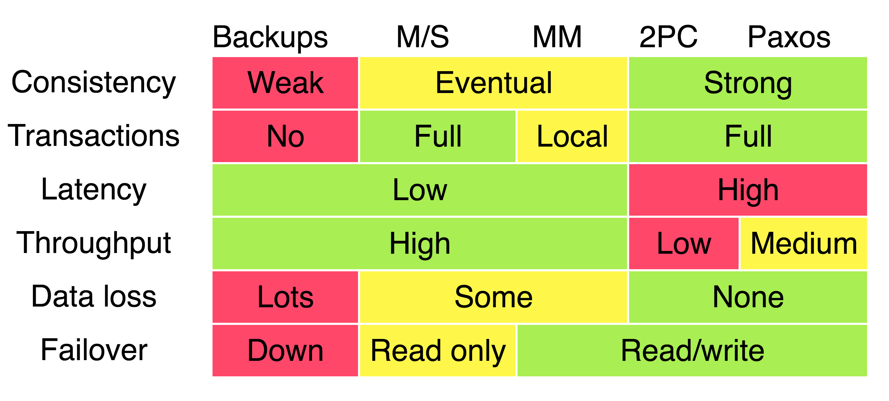

# 分布式系统中的协议

一、本章对分布式系统中的consistency、consensus、transaction、gossip等协议进行汇总统一说明。

二、我们知道，分布式系统的运行是依赖于节点之间相互passing message而运作的，因此，在分布式系统中，protocol占据着非常重要的位置。

三、达成共识consensus

## 参考文章

1、cdmana [Distributed consistency protocols and algorithms](https://cdmana.com/2020/11/20201113073232660u.html)

2、csdn [分布式一致性协议 - CAP、BASE、NWR](https://blog.csdn.net/gege87417376/article/details/109760184)

3、csdn [一致性协议算法-2PC、3PC、Paxos、Raft、ZAB、NWR超详细解析](https://blog.csdn.net/young_0609/article/details/111070578)

> 参见 `一致性协议算法-2PC-3PC-Paxos-Raft-ZAB-NWR` 章节

4、csdn [分布式一致性协议](https://blog.csdn.net/demon7552003/article/details/86657767)

> 参见 `csdn-分布式一致性协议` 章节

## 发展历程

一、2PC、3PC、**Paxos**、Raft、ZAB

二、**Paxos** 是一个划时代的算法，它对2PC、3PC进行了改进，Raft、ZAB都是基于 **Paxos**

### 2PC、3PC

zhihu [漫话分布式系统共识协议: 2PC/3PC篇](https://zhuanlan.zhihu.com/p/35298019)

讲得比较好

csdn [用太极拳讲分布式理论，真舒服！](https://blog.csdn.net/jackson0714/article/details/112002319?spm=1001.2014.3001.5501)

讲得一般

### Paxos

csdn [诸葛亮 VS 庞统，拿下 Paxos 共识算法](https://blog.csdn.net/jackson0714/article/details/112593110?spm=1001.2014.3001.5501)

讲得比较好

zhihu [漫话分布式系统共识协议: Paxos篇](https://zhuanlan.zhihu.com/p/35737689)

讲得一般

## 横向对比上述algorithm

|        | 2PC  | 3PC  | Paxos | Raft | ZAB  |
| ------ | ---- | ---- | ----- | ---- | ---- |
| 角色   |      |      |       |      |      |
| 阶段   |      |      |       |      |      |
| voting |      |      |       |      |      |

