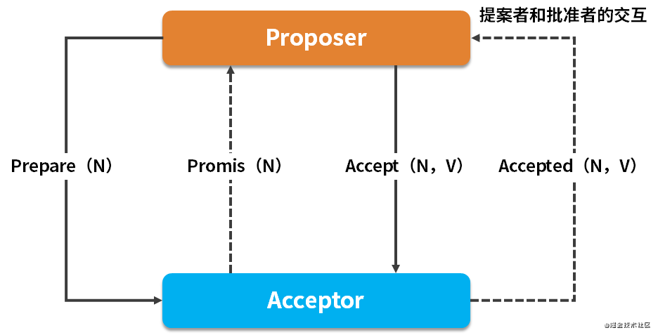

# csdn [说到分布式，重要的Paxos算法你看透了么？](https://blog.csdn.net/weixin_49723683/article/details/112375205)

## Quorum 机制

> NOTE: 
>
> 这一段其实是在讲 "NRW-quorum consistency"
>
> 内容一般

## Paxos

## Paxos 常见的问题

1、Acceptor 需要接受更大的 N，也就是 ProposalID，这有什么意义？

这种机制可以防止其中一个 Proposer 崩溃宕机产生阻塞问题，允许其他 Proposer 用更大 ProposalID 来抢占临时的访问权。

2、如何产生唯一的编号，也就是 ProposalID？

在《Paxos made simple》的论文中提到，唯一编号是让所有的 Proposer 都从不相交的数据集合中进行选择，需要保证在不同 Proposer 之间不重复。

比如系统有 5 个 Proposer，则可为每一个 Proposer 分配一个标识 j(0~4)，那么每一个 Proposer 每次提出决议的编号可以为 5*i+j，i 可以用来表示提出议案的次数。
