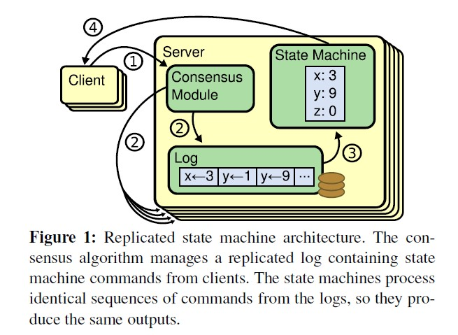

# usenix [In Search of an Understandable Consensus Algorithm](https://www.usenix.org/system/files/conference/atc14/atc14-paper-ongaro.pdf)

Diego Ongaro and John Ousterhout Stanford University

## Abstract

Raft is a **consensus algorithm** for managing a **replicated log**. It produces a result equivalent to (multi-)Paxos, and it is as efficient as Paxos, but its structure is different from Paxos; this makes Raft more  understandable than Paxos and also provides a better foundation for building practical systems. In order to enhance understandability, Raft separates the key elements of consensus, such as **leader election**, **log replication**, and **safety**, and it enforces a stronger degree of coherency to reduce the number of states that must be considered. Results from a user study demonstrate that Raft is easier for students to learn than Paxos. Raft also includes a new mechanism for changing the cluster membership, which uses overlapping majorities to guarantee safety.

## 1 Introduction

**Consensus algorithms** allow a collection of machines to work as a coherent group that can survive the **failures** of some of its members. Because of this, they play a key role in building reliable large-scale software systems. Paxos [13, 14] has dominated the discussion of **consensus algorithms** over the last decade: most implementations of consensus are based on Paxos or influenced by it, and Paxos has become the primary vehicle used to teach students about **consensus**.

Unfortunately, Paxos is quite difficult to understand, in spite of numerous attempts to make it more approachable. Furthermore, its architecture requires complex changes to support practical systems. As a result, both system builders and students struggle with Paxos.

After struggling with Paxos ourselves, we set out to find a new **consensus algorithm** that could provide a better foundation for system building and education. Our approach was unusual in that our primary goal was understandability: could we define a **consensus algorithm** for practical systems and describe it in a way that is significantly easier to learn than Paxos? Furthermore, we wanted the algorithm to facilitate the development of intuitions that are essential for system builders. It was important not just for the algorithm to work, but for it to be obvious why it works.

The result of this work is a consensus algorithm called ***Raft***. In designing Raft we applied specific techniques to improve understandability, including **decomposition** (Raft separates **leader election**, **log replication**, and **safety**) and **state space reduction** (relative to Paxos, Raft reduces the degree of nondeterminism and the ways servers can be inconsistent with each other). A user study with 43 students
at two universities shows that Raft is significantly easier to understand than Paxos: after learning both algorithms, 33 of these students were able to answer questions about Raft better than questions about Paxos.

Raft is similar in many ways to existing consensus algorithms (most notably, Oki and Liskov’s Viewstamped
Replication [27, 20]), but it has several novel features:

- ***Strong leader***: Raft uses a stronger form of leadership than other **consensus algorithms**. For example, log entries only flow from the **leader** to other servers. This simplifies the management of the **replicated log** and makes Raft easier to understand.

- ***Leader election***: Raft uses randomized timers to elect leaders. This adds only a small amount of mechanism to the heartbeats already required for any consensus algorithm, while resolving conflicts simply and rapidly.

- ***Membership changes***: Raft’s mechanism for changing the set of servers in the cluster uses a new ***joint consensus*** approach where the majorities of two different configurations overlap during transitions. This allows the cluster to continue operating normally during configuration changes

  > NOTE : 这是什么意思？是指当leader更换的时候？

We believe that Raft is superior to Paxos and other **consensus algorithms**, both for educational purposes and as a foundation for implementation. It is simpler and more understandable than other algorithms; it is described completely enough to meet the needs of a practical system; it has several open-source implementations and is used by several companies; its **safety properties** have been formally specified and proven; and its efficiency is comparable to other algorithms.

The remainder of the paper introduces the **replicated state machine problem** (Section 2), discusses the strengths and weaknesses of Paxos (Section 3), describes our general approach to understandability (Section 4), presents the Raft consensus algorithm (Sections 5–7), evaluates Raft (Section 8), and discusses related work (Section 9). A few elements of the Raft algorithm have been omitted here because of space limitations, but they are available in an extended technical report [29]. The additional material describes how clients interact with the system, and how **space** in the **Raft log** can be reclaimed.

## 2 Replicated state machines

> NOTE: 
>
> 这一段关于Replicated state machine的介绍是非常好的，容易理解，并且图示也非常形象

**Consensus algorithms** typically arise in the context of **replicated state machines** [33]. In this approach, **state machines** on a collection of servers compute identical copies of the same state and can continue operating even if some of the servers are down. **Replicated state machines** are used to solve a variety of **fault tolerance problems** in distributed systems. For example, large-scale systems that have a single **cluster leader**, such as GFS [7], HDFS [34], and RAMCloud [30], typically use a separate **replicated state machine** to manage **leader election** and store configuration information that must survive leader crashes. Examples of **replicated state machines** include Chubby [2] and ZooKeeper [9].

> NOTE : [Chubby](https://static.googleusercontent.com/media/research.google.com/zh-CN//archive/chubby-osdi06.pdf)，[ZooKeeper](https://zookeeper.apache.org/)

Figure 1: Replicated state machine architecture. The consensus algorithm manages a replicated log containing state machine commands from clients. The state machines process identical sequences of commands from the logs, so they produce the same outputs.

**Replicated state machines** are typically implemented using a **replicated log**, as shown in Figure 1. Each server stores a log containing a series of commands, which its **state machine** executes in order. Each log contains the same commands in the same order, so each **state machine** processes the same sequence of commands. Since the **state machines** are deterministic, each computes the same state and the same sequence of outputs.

Keeping the **replicated log** consistent is the job of the **consensus algorithm**. The **consensus module** on a server receives **commands** from clients and adds them to its **log**. It communicates with the **consensus modules** on other servers to ensure that every log eventually contains the same requests in the same order, even if some servers fail. Once commands are properly replicated, each server’s **state machine** processes them in log order, and the outputs are returned to clients. As a result, the servers appear
to form a single, highly reliable state machine.

**Consensus algorithms** for practical systems typically have the following properties:

- They ensure safety (never returning an incorrect result) under all non-Byzantine conditions, including network delays, partitions, and packet loss, duplication, and reordering.
- They are fully functional (available) as long as any majority of the servers are operational and can communicate with each other and with clients. Thus, a typical cluster of five servers can tolerate the failure of any two servers. Servers are assumed to fail by stopping; they may later recover from state on stable storage and rejoin the cluster.
- They do not depend on timing to ensure the consistency of the logs: faulty clocks and extreme message delays can, at worst, cause availability problems.

- In the common case, a command can complete as soon as a majority of the cluster has responded to a single round of remote procedure calls; a minority of slow servers need not impact overall system performance

## 5 The Raft consensus algorithm

**Raft** is an algorithm for managing a **replicated log** of the form described in Section 2. Figure 2 summarizes the algorithm in condensed（浓缩的，简明扼要的） form for reference, and Figure 3 lists key properties of the algorithm;the elements of these figures are discussed piecewise over the rest of this section.

> NOTE : 在raft运行过程中，leader承担着核心的角色，它是raft算法的核心所在，感觉从这个角度来看，raft算法是中心化的，显然在中心化的cluster中，一个显著的特点就是节点是有角色属性的（比如在raft中，就有leader，follower等角色），而在去中心化的cluster中，节点是不具备角色属性的；

Raft implements **consensus** by first electing a distinguished leader, then giving the **leader** complete responsibility for managing the **replicated log**. The **leader** accepts **log entries** from clients, replicates them on other servers, and tells servers when it is safe to apply **log entries** to their **state machines**. Having a **leader** simplifies the management of the **replicated log**. For example,the leader can decide where to place new entries in the log without consulting other servers, and data flows in a simple fashion from the leader to other servers. A leader can fail or become disconnected from the other servers, in which case a new leader is elected.

Given the **leader** approach, Raft decomposes the **consensus problem** into three relatively independent sub problems, which are discussed in the subsections that follow:

- Leader election: a new leader must be chosen when an existing leader fails (Section 5.2).

- Log replication: the leader must accept log entries from clients and replicate them across the cluster, forcing the other logs to agree with its own (Section 5.3).

  > NOTE : 其实在redis中，replication的过程和这是非常类似的；

- Safety: the key safety property for Raft is the **State Machine Safety Property** in Figure 3: if any server has applied a particular log entry to its **state machine**, then no other server may apply a different command for the same **log index**. Section 5.4 describes how Raft ensures this property; the solution involves an additional restriction on the **election mechanism** described in Section 5.2.

After presenting the **consensus algorithm**,this section discusses the issue of availability and the role of timing in the system.

#### Figure2

> # State
>
> ## Persistent state on all servers:
>
> (Updated on stable storage before responding to RPCs)
> |               |                                                              |
> | ------------- | ------------------------------------------------------------ |
> | `currentTerm` | latest **term** server has seen (initialized to 0 on first boot, increases monotonically（单调的）) |
> | `votedFor`    | `candidateId` that received vote in current term (or null if none) |
> | `log[]`       | log entries; each entry contains command for **state machine**, and term when entry was received by leader (first index is 1) |
> ## Volatile state on all servers:
>
> |               |                                                              |
> | ------------- | ------------------------------------------------------------ |
> | `commitIndex` | index of highest log entry known to be committed (initialized to 0, increases monotonically) |
> | `lastApplied` | index of highest log entry applied to state machine (initialized to 0, increases monotonically) |
>
> 

Figure2: A condensed summary of the Raft consensus algorithm (excluding membership changes and log compaction). The server behavior in the upper-left box is described as a set of rules that trigger independently and repeatedly. Section numbers such as §5.2 indicate where particular features are discussed. A formal specification [28] describes the algorithm more precisely.

#### Figure 3

> **Election Safety**: at most one leader can be elected in a given term. §5.2
>
> > NOTE : 如何来保证？在distributed system中，这样的问题是非常普遍的：如何保证只有一个node被选为leader？在redis中，这个问题就是如何保证只有一个slave被选为master？
>
> **Leader Append-Only**: a leader never overwrites or deletes entries in its log; it only appends new entries. §5.3
>
> **Log Matching**: if two logs contain an entry with the same **index** and **term**, then the logs are identical in all entries up through the given index. §5.3
>
> **Leader Completeness**: if a **log entry** is committed in a given **term**, then that **entry** will be present in the logs of the leaders for all higher-numbered terms. §5.4
>
> **State Machine Safety**: if a server has applied a log entry at a given index to its state machine, no other server will ever apply a different log entry for the same index. §5.4.3

Figure 3: Raft guarantees that each of these properties is true at all times. The section numbers indicate where each property is discussed.

### 5.1 Raft basics

A Raft cluster contains several servers; five is a typical number, which allows the system to tolerate two failures. At any given time each server is in one of three states: **leader**, **follower**, or **candidate**. In normal operation there is exactly one **leader** and all of the other servers are **followers**. **Followers** are passive: they issue no requests on their own but simply respond to requests from **leaders** and **candidates**. The **leader** handles all client requests (if a client contacts a follower, the follower redirects it to the leader). The third state, candidate, is used to elect a new leader as described in Section 5.2. Figure 4 shows the states and their transitions; the transitions are discussed below.

#### Figure 4

Figure 4: Server states. Followers only respond to requests from other servers. If a follower receives no communication, it becomes a candidate and initiates an election. A candidate that receives votes from a majority of the full cluster becomes the new leader. Leaders typically operate until they fail.

Raft divides time into **terms** of arbitrary length, as shown in Figure 5. Terms are numbered with consecutive integers. Each **term** begins with an **election**, in which one or more candidates attempt to become leader as described in Section 5.2. If a candidate wins the election, then it serves as leader for the rest of the term. In some situations an election will result in a **split vote**. In this case the term will end with no leader; a new term (with a new election) will begin shortly. Raft ensures that there is at most one leader in a given term.

#### Figure 5

Figure 5: Time is divided into **terms**, and each **term** begins with an **election**. After a successful election, a single leader manages the cluster until the end of the term. Some elections fail, in which case the term ends without choosing a leader. The transitions between terms may be observed at different times on different servers.

Different servers may observe the transitions between terms at different times, and in some situations a server may not observe an election or even entire terms. Terms act as a **logical clock** [12] in Raft, and they allow servers to detect **obsolete information**（陈旧信息） such as stale leaders. Each server stores a ***current term*** number, which increases monotonically over time. **Current terms** are exchanged whenever servers communicate; if one server’s **current term** is smaller than the other’s, then it updates its **current term** to the **larger value**. If a candidate or leader discovers that its term is out of date, it immediately reverts to **follower state**. If a server receives a request with a stale term number, it rejects the request.

> NOTE : 要想准确地理解term的用途，必须要阅读论文[12] ，其实在这篇论文中就说明了：

> A **distributed algorithm** is given for synchronizing a system of **logical clocks** which can be used to totally order the events.

其实它非常了类似[Lamport timestamps](https://en.wikipedia.org/wiki/Lamport_timestamps)，显然，raft中，使用term来作为logical clock，使用它来order message；在[Understanding Lamport Timestamps with Python’s multiprocessing library](https://towardsdatascience.com/understanding-lamport-timestamps-with-pythons-multiprocessing-library-12a6427881c6)中，对它的解释是非常好的，需要参考那篇文章；

需要注意的是，raft中的term其实并不是完全的使用的[Lamport timestamps](https://en.wikipedia.org/wiki/Lamport_timestamps)，而是借鉴于它，并进行了调整，它的调整是为了适应raft中在leader election阶段的各种问题的；

> NOTE : 第一句话是什么意思？

Raft servers communicate using **remote procedure calls** (RPCs), and the **consensus algorithm** requires only two types of RPCs. **RequestVote RPCs** are initiated by candidates during elections (Section 5.2), and AppendEntries RPCs are initiated by leaders to **replicate log entries** and to provide a form of **heartbeat** (Section 5.3). Servers retry RPCs if they do not receive a response in a timely manner, and they issue RPCs in parallel for best performance.

### 5.2 Leader election

Raft uses a **heartbeat mechanism** to trigger **leader election**. When servers start up, they begin as followers. A server remains in follower state as long as it receives valid RPCs from a leader or candidate. Leaders send periodic heartbeats(AppendEntries RPCs that carry no logentries) to all followers in order to maintain their authority. If a follower receives no communication over a period of time called the ***election timeout***, then it assumes there is no viable leader and begins an election to choose a new leader.

To begin an election, a follower increments its **current term** and transitions to **candidate state**. It then votes for itself and issues RequestVote RPCs in parallel to each of the other servers in the cluster. A candidate continues in this state until one of three things happens: (a) it wins the election, (b) another server establishes itself as leader, or (c) a period of time goes by with no winner. These outcomes are discussed separately in the paragraphs below.

A candidate wins an election if it receives votes from a majority of the servers in the full cluster for the same term. Each server will vote for at most one candidate in a given term, on a first-come-first-served basis (note: Section 5.4 adds an additional restriction on votes). The majority rule ensures that at most one candidate can win the election for a particular term (the Election Safety Property in Figure 3). Once a candidate wins an election, it becomes leader. It then sends heartbeat messages to all of the other servers to establish its authority and prevent new elections.

While waiting for votes, a candidate may receive an AppendEntries RPC from another server claiming to be
leader. If the leader’s term (includedin its RPC) is at least as large as the candidate’s current term, then the candidate recognizes the leader as legitimate and returns to follower state. If the term in the RPC is smaller than the candidate’s current term, then the candidate rejects the RPC and continues in candidate state.

The third possible outcome is that a candidate neither wins nor loses the election: if many followers become candidates at the same time, votes could be split so that no candidate obtains a majority. When this happens, each candidate will time out and start a new election by incrementing its term and initiating another round of Request-Vote RPCs. However, without extra measures split votes could repeat indefinitely.

Raft uses **randomized election timeouts** to ensure that **split votes** are rare and that they are resolved quickly. To prevent split votes in the first place, election timeouts are chosen randomly from a fixed interval (e.g., 150–300ms). This spreads out the servers so that in most cases only a single server will time out; it wins the election and sends heartbeats before any other servers time out. The same mechanism is used to handle split votes. Each candidate restarts its randomized election timeout at the start of an election, and it waits for that timeout to elapse before starting the next election; this reduces the likelihood of another split vote in the new election. Section 8.3 shows that this approach elects a leader rapidly.

Elections are an example of how understandability guided our choice between design alternatives. Initially
we planned to use a ranking system: each candidate was assigned a unique rank, which was used to select between competing candidates. If a candidate discovered another candidate with higher rank, it would return to follower state so that the higher ranking candidate could more easily win the next election. We found that this approach created subtle issues around availability (a lower-ranked server might need to time out and become a candidate again if a higher-ranked server fails, but if it does so too soon, it can reset progress towards electing a leader). We made adjustments to the algorithm several times, but after
each adjustment new corner cases appeared. Eventually we concluded that the randomized retry approach is more obvious and understandable.

### 5.3 Log replication

Once a leader has been elected, it begins servicing client requests. Each client request contains a command to be executed by the **replicated state machines**. The leader appends the command to its log as a new entry, then issues **AppendEntries RPCs** in parallel to each of the other servers to replicate the entry. When the entry has been safely replicated (as described below), the leader applies the entry to its state machine and returns the result of that execution to the client. If followers crash or run slowly, or if network packets are lost, the leader retries Append-Entries RPCs indefinitely (even after it has responded to the client) until all followers eventually store all log entries.

**Logs** are organized as shown in Figure 6. Each **log entry** stores a **state machine command** along with the **term number** when the entry was received by the leader. The **term numbers** in log entries are used to detect inconsistencies between logs and to ensure some of the properties in Figure 3. Each **log entry** also has an **integer index** identifying its position in the log.

## References

## [12]

[12] [L AMPORT , L. Time, clocks, and the ordering of events in a distributed system](https://lamport.azurewebsites.net/pubs/time-clocks.pdf). Commununications of the ACM 21, 7 (July 1978), 558–565.