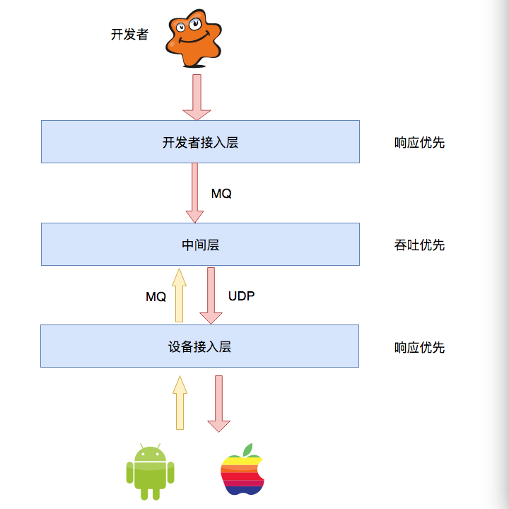
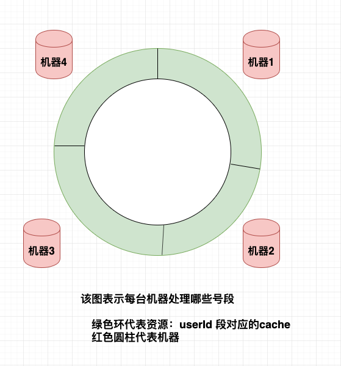
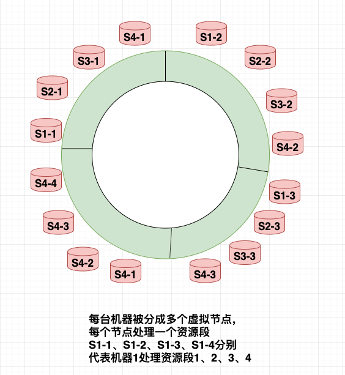

# cnblogs [给面试官讲明白：一致性Hash的原理和实践](https://www.cnblogs.com/jingangtx/p/11338592.html)

“一致性hash的设计初衷是解决分布式缓存问题，它不仅能起到hash作用，还可以在服务器宕机时，尽量少地迁移数据。因此被广泛用于**状态服务**的**路由功能**”

## 01分布式系统的路由算法

假设有一个消息推送系统，其简易架构如下

)

**设备接入层**不仅要接收设备的登录、下线等状态命令，还要把开发者的消息推送给设备。这个时候设备接入层就需要维护设备的**状态信息**（当然可以专门拆一个**状态服务**去维护这些信息，要求这部分必须少有代码更新，具体原因自己去想哦=_=）。这个时候设备接入层的每台server都保留一批设备的状态信息cache，设备应该连接哪台server去获取数据，同时**中间层**的消息又该发往哪个server去推送呢？这就用到了一致性hash算法。

## 02什么是一致性hash算法

一致性hash由对象、资源、算法和机器组成。它要做的是：对象通过算法判断连哪台机器。在如上系统中：设备id（`userID`）为对象；其对应的状态数据(cache)为资源；服务器为机器。

> NOTE: 
>
> 1、目的是将设备的请求分散到集群中，因此使用设备id（`userID`）作为key，将它进行划分
>
> 2、一般要保持`userID`为**monotonic**，这样才能够将它划分为多个区间
>
> 

在一致性hash算法中，这些资源围成了一个闭环，每台机器又保存着一个资源段，每个资源段对应一批对象/设备；这样如果某台机器挂了，那它对应的资源转移到离它较近的**机器x**，这台dead server对应的设备连接到机器x就行。

现在假设这四个资源段对应的设备，活跃情况相差较大。比如说资源段1、2对应的设备特别活跃，而资源段3和4几乎没活动。这样机器1-2需要保存大量的状态数据，而3-4则有大量的空置，显然是不合理的。改进版的一致性hash算法是这样操作的：它不再是每台机器去保存一个连续的资源段，而是让每台机器都保存多个区域的部分资源段。如机器1保存每个资源段的1/4，机器2保存每个资源段的1/4，机器3、4同样如此。这样即使个别号段有热点，也会**均摊**到不同的机器。

> NOTE: 
>
> 一、上面提到的这种"均摊来避免热点"的做法是值得借鉴的，"amortize-to-avoid-hot-point-均摊避免集中热点"
>
> 二、这其实是Cassandra中的virtual node trick，virtual node是非常类似于Redis的hash slot的

## 03一致性hash在系统中的应用

如上介绍了一致性hash的概念和改进，在系统实践中，我们用户量非常大，往往不只一个集群。我们是如此使用一致性hash：

1、首先根据不同号段选择对应的集群，这部分是可配置的

2、确定集群后，根据一致性hash把设备匹配到server的某个instance上(每台server部署多个设备接入层实例（1.每个instance保存的状态信息更分散;2.服务的gc问题会有缓解）

3、建立机器虚拟节点：把user逆序(打乱之前连续`userId`)，组成新的资源段;相当于建立了server虚拟节点

> NOTE: 
>
> virtual node

4、记录每台server锁服务的设备数，如果机器A挂了，挑选服务设备数最少的机器去承接kicked-device

## 04不是所有情况都适合一致性hash

以上介绍了一致性Hash的原理和实践，但不是所有的服务都适合用一致性hash来路由。比如01节中的消息推送系统，中间层是无状态的，开发者接入层请求cluter-A的哪台机器都行，它只要做完基本校验后，把消息异步发给MQ即可，无需等待结果直接返回; 而设备接入层是有状态的，且对较高时延无法忍受，更适合一致性Hash选择好server-instance，然后通过TCP/UDP来通信。

