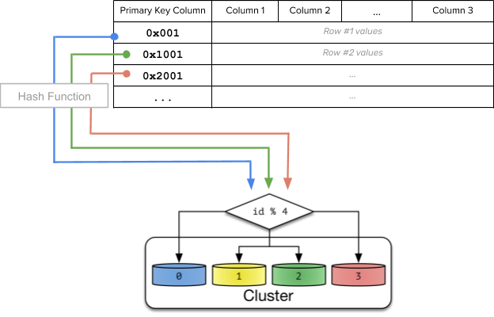

# yugabyte [Four Data Sharding Strategies We Analyzed in Building a Distributed SQL Database](https://blog.yugabyte.com/four-data-sharding-strategies-we-analyzed-in-building-a-distributed-sql-database)

> NOTE: 
>
> 对各种策略总结地比较好

A distributed SQL database needs to automatically partition the data in a table and distribute it across nodes. This is known as **data sharding** and it can be achieved through different strategies, each with its own tradeoffs. In this post, we will examine various data sharding strategies for a distributed SQL database, analyze the tradeoffs, explain the rationale for which of these strategies YugabyteDB supports and what we picked as the default **sharding strategy**.

## Lessons from building sharded data systems

Data sharding helps in scalability and geo-distribution by horizontally partitioning data. A SQL table is decomposed into multiple sets of rows according to a specific sharding strategy. Each of these sets of rows is called a shard. These shards are distributed across multiple server nodes (containers, VMs, bare-metal) in a **shared-nothing architecture**. This ensures that the shards do not get bottlenecked by the compute, storage and networking resources available at a single node. High availability is achieved by replicating each shard across multiple nodes. However, the application interacts with a SQL table as one logical unit and remains agnostic(不知) to the physical placement of the shards. In this section, we will outline the pros, cons and our practical learnings from the sharding strategies adopted by these databases.

### Memcached and Redis – Algorithmic Sharding

**Distributed caches** have had to distribute data across multiple nodes for a while. A commonly used technique is **algorithmic sharding**, where each key consistently maps to the same node. This is achieved by computing a numeric hash value out of the key and computing a modulo of that hash using the total number of nodes to compute which node owns the key.

> *Part of the image from source: [How Sharding Works](https://medium.com/@jeeyoungk/how-sharding-works-b4dec46b3f6)*

**Pros**
In algorithmic sharding, the client can determine a given partition’s database without any help.

**Cons**
When a new node is added or removed, the ownership of almost all keys would be affected, resulting in a massive redistribution of all the data across nodes of the cluster. While this is not a correctness issue in a distributed cache (because cache misses will repopulate the data), it can have a huge performance impact since the entire cache will have to be warmed again.

> NOTE: 
>
> 一、上述分析仅仅是从算法本身来进行的，并没有结合 Redis 和 memcache 的具体情况来进行分析，为什么它们要这样做；
>
> 二、Redis中，将它的shard strategy称为hash slot；

**Analysis**
Adding and removing nodes is fundamental to a distributed database, and these operations need to be efficient.

This makes this type of sharding a poor option and is not implemented in YugabyteDB.

**References:**

1、Sharding data across a memcache tier from “[Distributed Caching with Memcached”](https://www.linuxjournal.com/article/7451)

2、Algorithmic sharding from “[How Sharding Works”](https://medium.com/@jeeyoungk/how-sharding-works-b4dec46b3f6)

### Initial Implementation in Cassandra – Linear Hash Sharding

> NOTE: 
>
> 并没有获得实际的运用

Linear hash sharding is a hybrid between hash and range sharding that preserves the sort order of the rows by utilizing a [linear hash function](https://xlinux.nist.gov/dads/HTML/linearhash.html) instead of a regular random hash function to compute how to shard the rows. A linear hash function, sometimes referred to as an order preserving hash, is a hash function that maintains the relative ordering of input values while changing their distribution spacing. This type of sharding preserves the sort ordering of the rows, while redistributing these rows across a larger key space. The idea is that the larger key space over which the redistribution of rows is done can be pre-sharded, enabling the table to be spread across multiple nodes.

**Pros**
In theory, this type of sharding allows efficiently querying a range of rows by the primary key values while enabling pre-splitting of the table into multiple shards.

**Cons**
In practice, this sharding strategy was problematic because it was impossible to pick good shard split boundaries ahead of time. The primary disadvantage of linear hash sharding is that the data is never evenly distributed between partitions, and thus results in hotspots.

> NOTE: 
>
> 实际使用的困难: 无法挑选一个好的的"shard split boundaries ahead of time"

**Analysis**
While useful in theory, these are only a narrow set of use-cases that can leverage this sharding strategy effectively. In the case of Cassandra, the default sharding strategy was changed from linear hash sharding to consistent sharding to improve scalability and performance.

Hence, this is a poor sharding strategy and is not implemented in YugabyteDB.

### DynamoDB and Cassandra – Consistent Hash Sharding

> NOTE: 
>
> 这种是被广泛采用的

With consistent hash sharding, data is evenly and randomly distributed across shards using a partitioning algorithm. Each row of the table is placed into a shard determined by computing a consistent hash on the partition column values of that row. This is shown in the figure below.

**Cons**
Performing range queries could be inefficient. Examples of range queries are finding rows greater than a lower bound or less than an upper bound (as opposed to point lookups).

### Google Spanner and HBase – Range Sharding

Range sharding involves splitting the rows of a table into contiguous ranges that respect the sort order of the table based on the primary key column values. The tables that are range sharded usually start out with a single shard. As data is inserted into the table, it is dynamically split into multiple shards because it is not always possible to know the distribution of keys in the table ahead of time. The basic idea behind range sharding is shown in the figure below.

**Pros**
This type of sharding allows efficiently querying a range of rows by the primary key values. Examples of such a query is to look up all keys that lie between a lower bound and an upper bound.

**Cons**
Range sharding leads to a number of issues in practice at scale, some of which are similar to that of linear hash sharding.

## Putting it all together

### Support for consistent hash and range sharding

Because all of the above properties are desirable, we decided to include [both consistent hash and range sharding](https://docs.yugabyte.com/latest/api/ysql/commands/ddl_create_table/#primary-key) in YugabyteDB. 
